#SourceTree安装与使用方法  

  2019年01月10日  
  
  ---

### 一 、SourceTree简介
>  
SourceTree 是 Windows 和Mac OS X 下免费的 [Git](http://lib.csdn.net/base/git "Git知识库") 和 Hg 客户端，拥有可视化界面，容易上手操作。同时它也是Mercurial和Subversion[版本控制](http://lib.csdn.net/base/git "Git知识库")系统工具。支持创建、提交、clone、push、pull 和merge等操作。

### 二、下载安装SourceTree步骤
>  
1、下载地址：[https://www.sourcetreeapp.com/](https://www.sourcetreeapp.com/)，该版本是中文的下载完成后可以进行安装。   
2、安装SourceTree   
安装首界面   
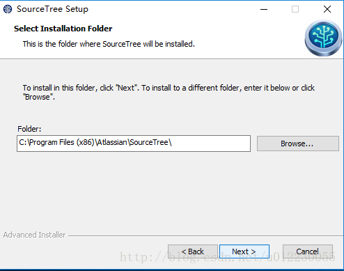  
点击，Next   
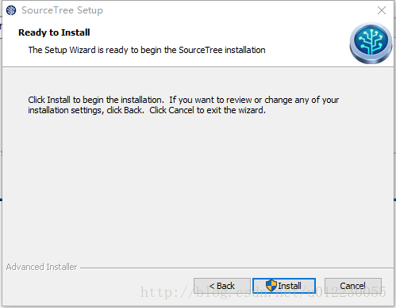  
点击“install”，安装完成后，打开sourcetree，点击“user an existing account”,如图   
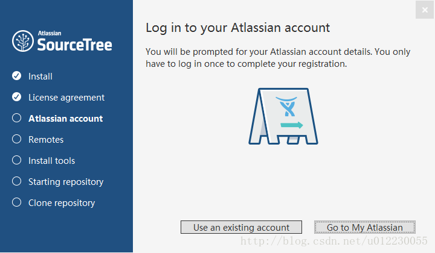  
注意：1使用谷歌帐号登录即可，前提是你必须可以上谷歌才可以。   
GOOGLE帐号登录完成之后，如图：   
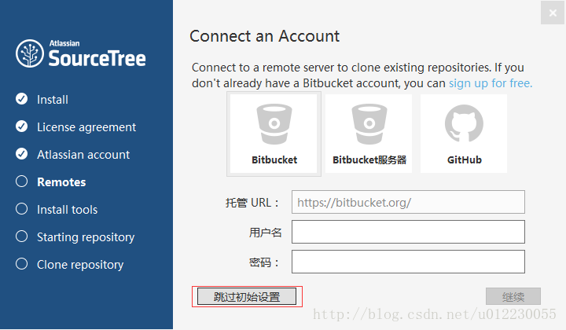  
此处无需设置，直接点击“跳过初始设置”即可。   
登录注册成功后，弹出设置puttykey的界面，点击“取消”即可。   

点击“取消”按钮，弹出如下提示框：   
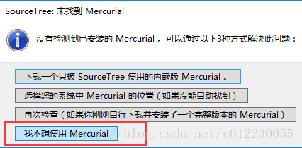
此时进入到sourcetree的主界面，现在就可以使用sourcetree啦。

### 三、集成文件对比插件
>  
安装对比插件  
Sourcetree中集成Beyond Compare 4，当文件冲突时可以很好的解决冲突。安装过程很简单，这里不再详述。  
Sourcetree中配置Beyond Compare 4  
菜单栏，“工具”——“选项”，如图所示：   
  
选择“比较”选项卡，然后将红色方框处的内容修改为如图所示：   
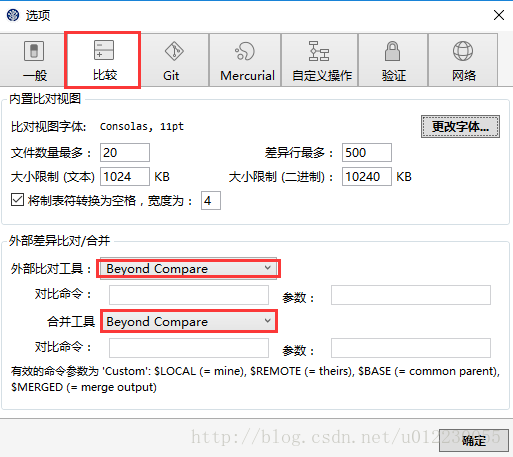  

### 四、SourceTree基本使用
>  #### （1）克隆    
点击克隆按钮，克隆项目：   
既可以是本地已有的git项目，也可以是远程目录中的项目，   
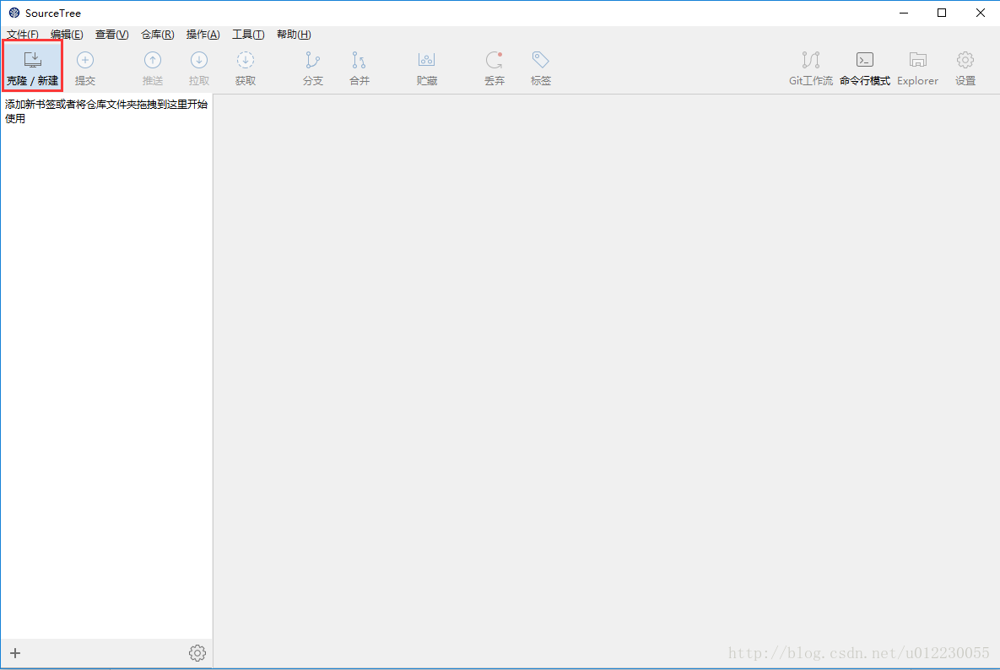  
本地存在的git项目，   
获取项目克隆地址，点击克隆按钮，如图所示：   
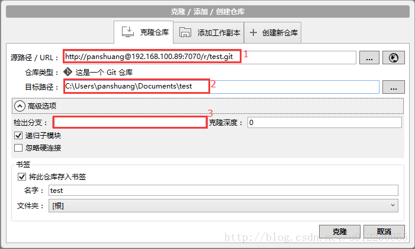  
1、克隆项目的路径   
2、克隆项目存放的位置   
3、如果要下载特定的分支，可以按分支进行下载  
>  #### （2）配置忽略文件    
利用.gitignore过滤文件，如编译过程中的中间文件，等等，这些文件不需要被追踪管理。   
.gitignore文件只对还没有加入版本管理的文件起作用，如果之前已经用git把这些文件纳入了版本库，就不起作用了   
使用sourcetree添加忽略文件的方法：   
正常情况下，管理员创建项目后需要直接将忽略文件创建好。创建方法如图：   
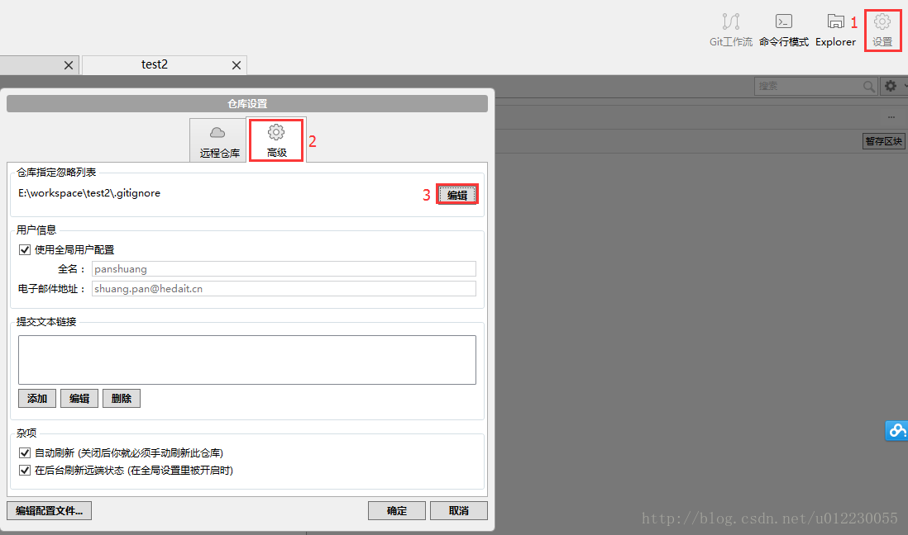  
按照如上步骤操作即可编辑冲突文件。   
冲突文件规则：   
忽略文件夹（如：bin、obj）：   
obj/   
bin/   
某目录下的所有.txt文件，   
obj/*.txt   
开发的过程中可能遇到一些忽略文件中未添加的文件，此时需要开发者自行添加忽略文件，添加方法如下：   
之前已经介绍过未进行版本控制的或者受版本控制的文件，在sourcetree的“文件状态” 标签中查找，如图所示：   
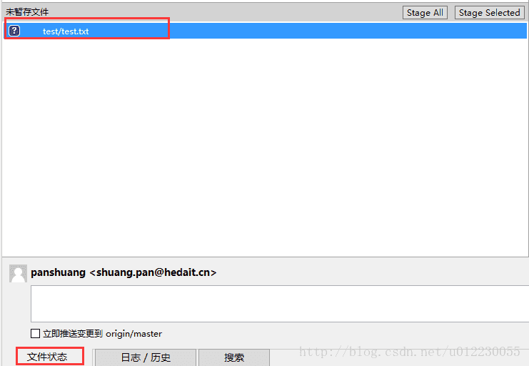  
鼠标右键要忽略的文件，点击“忽略”，选择忽略的模式，即可将文件进行忽略，如图所示：   
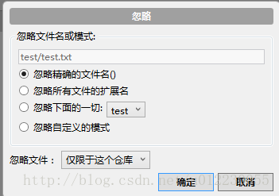  
>  #### （3）tag使用方法  
打tag的目的是在代码的主要节点处有个标记，方便下次修改代码时可以准确的找到想要找的代码。而无需看着日志文件逐一回忆要找的代码位置。   
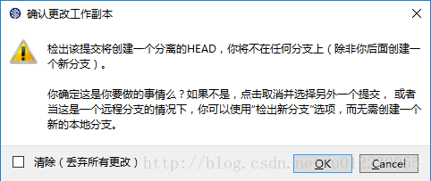  
>  #### （4）分支管理与使用  
使用sourcetree创建和使用分支是很方便的，不像之前使用的TortoiseGit只能在当前代码处创建分支，使用sourcetree的方便处：   
1、可以选择特定的某版本创建分支   
2、代码检出时可以按照分支进行检出   
3、分支的添加很简单   
分支添加：   
  
1、可以在当前的版本下创建分支   
2、选择指定的提交创建分支   
3、点击“创建分支”   
分支提交到服务器：   
在sourcetree右侧内容中的分支列表中，选中创建的分支，右键提交，如图所示：   
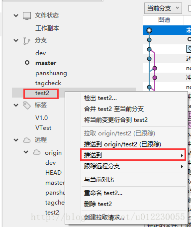  
分支合并：   
1、分支合并功能和分支添加功能类似，这里不再详述，需要注意的是首先要切换到被合并的分支上，再进行合并操作。   
2、分支合并时，可以选择具体的某提交进行合并，同时主分支可以合并到子分支；子分支可以合并到主分支；子分支之间也可以进行合并。  
>  #### （5）GIT与SVN同步  
git svn工具集在当前不得不使用 Subversion 服务器或者开发环境要求使用 Subversion 服务器的时候格外有用。不妨把它看成一个跛脚的 Git，在实际使用中不推荐这样使用GIT。  
>  #### （6）基本步骤  
提交、拉取和推送   
提交：   
项目提交是为了维护本地版本库，如果本地有未提交的内容，则不允许拉取和推送；如图所示区域有内容时，则代表本地未提交的内容：   
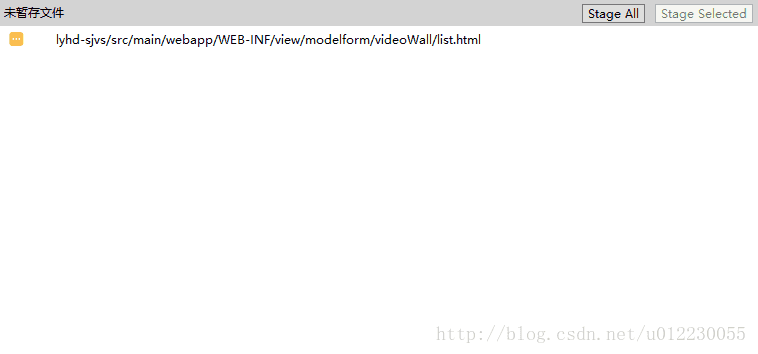  
点击Stage All，填写提交信息既可以将本地内容（暂存区）提交到本地版本库，如图所示：   
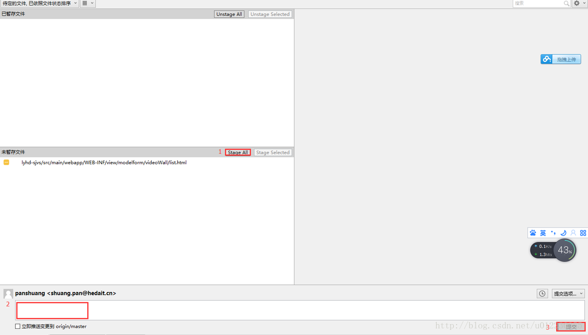  
1、将未暂存的文件进行暂存，如果有些文件不需要暂存，则可以进行删除，选中文件，右键“移除”即可。   
拉取：从远程将代码进行更新，相当于SVN的“更新”   
推送：将代码提交到远程。  
>  #### （7）解决冲突  
简单介绍   
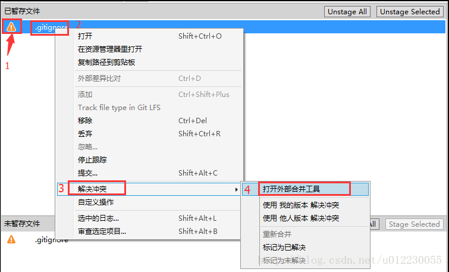  
1、冲突文件的符号为“感叹号”   
2、选中“冲突文件”，右键——点击”解决冲突“——点击”打开外部合并工具“（备注：才操作时已经安装外部合并工具，同时在sourcetree中已经进行配置，详见”集成文件对比插件“）  
冲突界面  
冲突解决界面如下：可以根据需要选择内容显示类型，只”显示更改“，”显示冲突“或者”全部“   
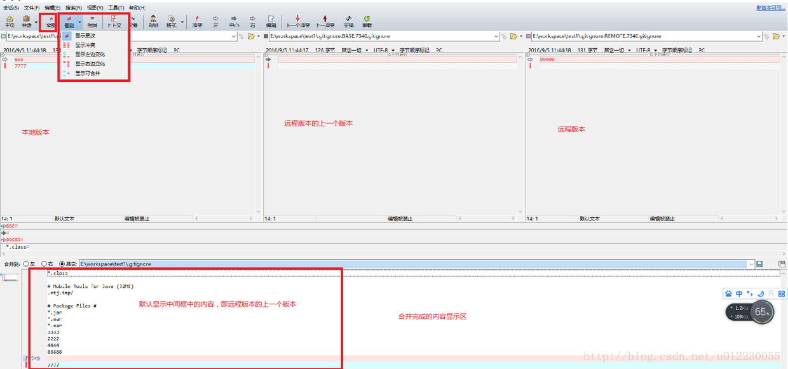  
解决冲突  
方法一：在相关的版本处，选中”冲突行”，合并区默认处于合并位置，鼠标右键，选择最终冲突地方留下的内容，如图：   
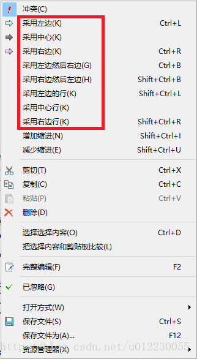  
解决冲突之后效果图：   
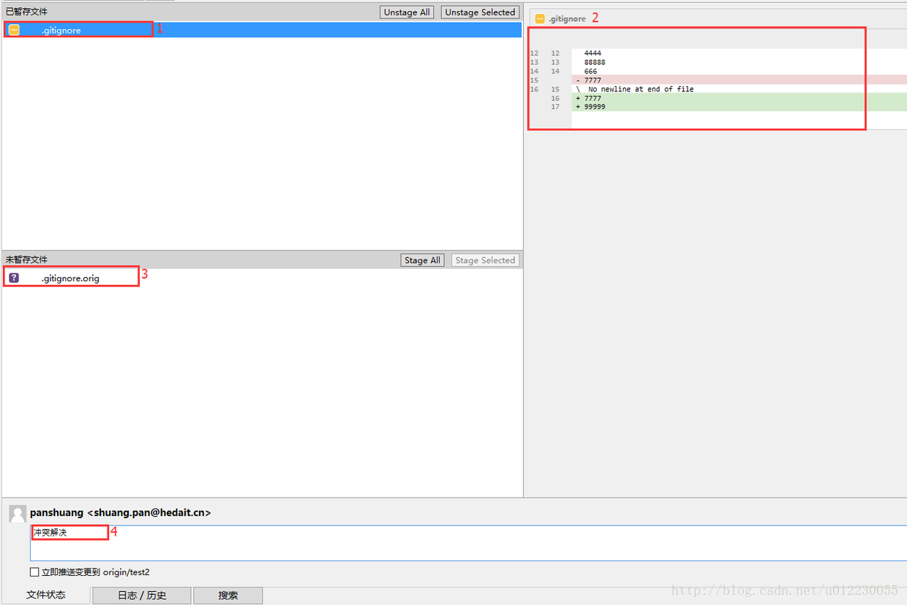  
1、冲突图标由”感叹号”——“省略号”。   
2、右侧显示修改后的代码进行查看。   
3、同时修改的冲突文件有相应的备份，大家可以下载到本地，方便冲突有问题再次修改文件。   
备注：该文件下载之后请将版本库中的该文件删除，不要上传到版本库中。   
4、修改完冲突之后，需要再次提交，推送。大家养成提交时，提交有效的日志信息，不要将比如：123之类的信息推送到服务器中。   
方法二：如果冲突非常少，可以直接在右侧栏中解决冲突，如图所示：   
  
1、点击未暂存区域的冲突文件。   
2、右侧列表中出现冲突的内容。   
3、选择冲突内容，解决冲突，如图所示：   
  
暂存行：表示保留该内容   
丢弃行：表示删除该内容   
备注：区分于第一种方式，使用第一种方法解决时，不要点击”未暂存文件”,否则可能无法打开冲突文件  
>  #### （8）版本回退    
原则上，代码推送之前要保证本地的代码可运行，不要将不可运行或者有问题的代码推送到服务器上，如果由于误操作，将代码推送到了远程，想重新修改上传代码，此时，需要将版本进行回退，回退方法如图：   
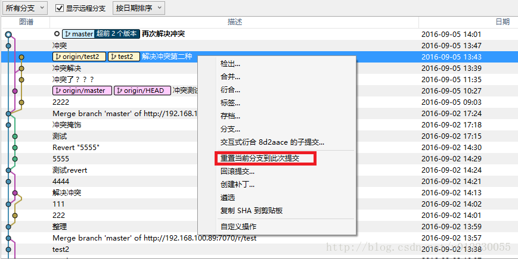  
1、切换到日志/历史标签   
2、选择要恢复到的版本，如图蓝色位置   
3、鼠标右键，选择“重置当前分支到此次提交”   
4、选择”重置模式”，如图所示   
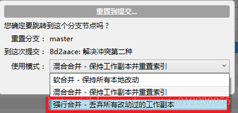  
5、弹出框中选择”Yes”   
  
>  #### （9）相关提示信息含义  
冲突信息   
  
先更新信息   
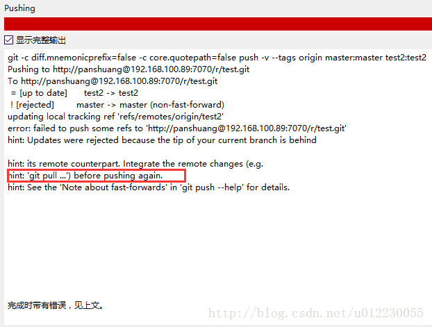  
小窍门：   
  
如果推送时，拉取右上方显示数字，则需要先拉取再推送。  

### 五、SourceTree&Git部分名词解释
>  
克隆(clone)：从远程仓库URL加载创建一个与远程仓库一样的本地仓库   
提交(commit)：将暂存文件上传到本地仓库（我们在Finder中对本地仓库做修改后一般都得先提交一次，再推送）   
检出(checkout)：切换不同分支   
添加（add）：添加文件到缓存区   
移除（remove）：移除文件至缓存区   
暂存(git stash)：保存工作现场   
重置(reset)：回到最近添加(add)/提交(commit)状态   
合并(merge)：将多个同名文件合并为一个文件，该文件包含多个同名文件的所有内容，相同内容抵消   
抓取(fetch)：从远程仓库获取信息并同步至本地仓库   
拉取(pull)：从远程仓库获取信息并同步至本地仓库，并且自动执行合并（merge）操作，即 pull=fetch+merge   
推送(push)：将本地仓库同步至远程仓库，一般推送（push）前先拉取（pull）一次，确保一致   
分支(branch)：创建/修改/删除分枝   
标签(tag):给项目增添标签   
工作流(Git Flow):团队工作时，每个人创建属于自己的分枝（branch），确定无误后提交到master分枝   
终端(terminal):可以输入git命令行
