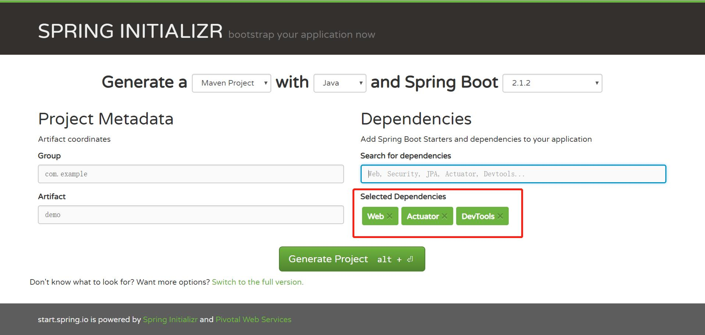
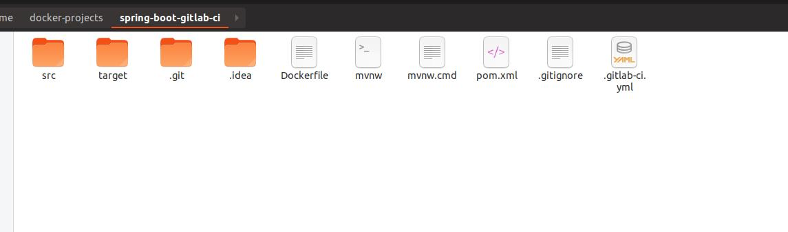
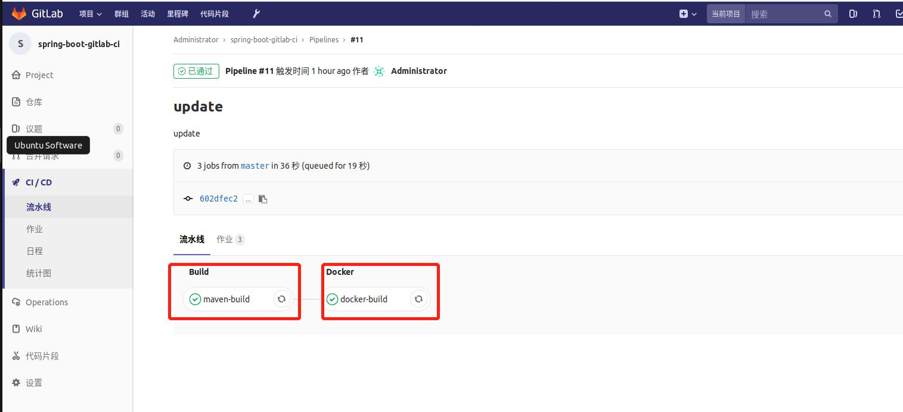
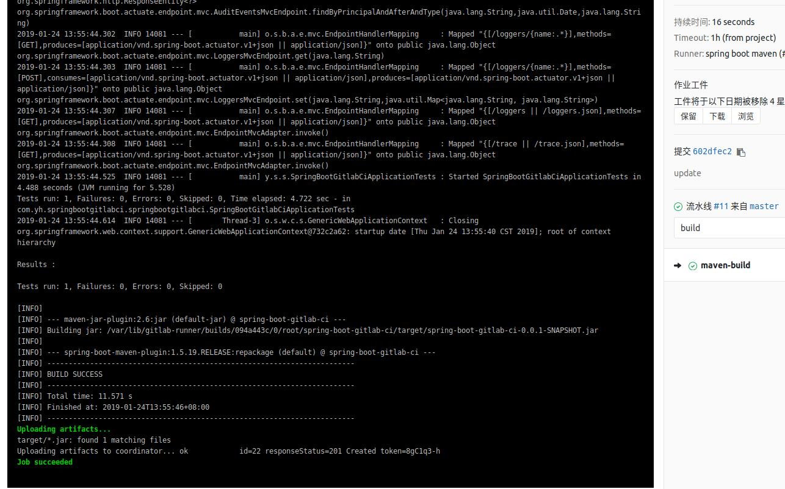
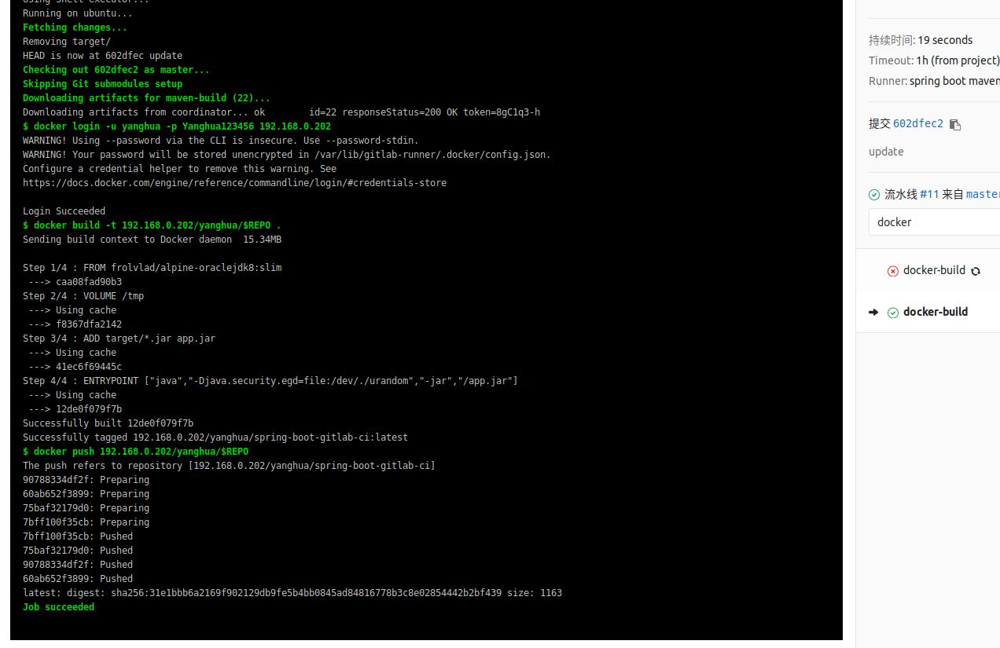
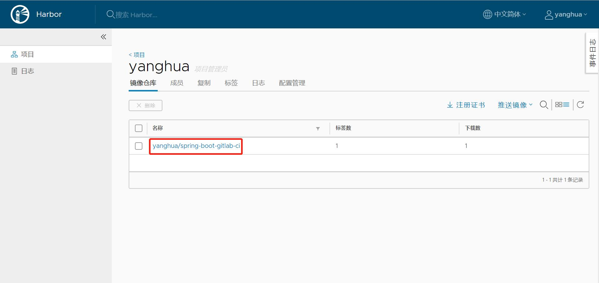
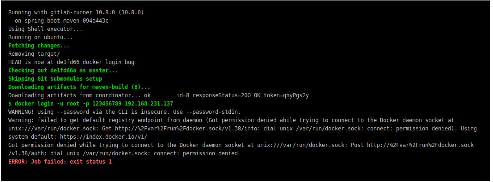

# gitlab ci与docker集成

## 一、目标

gitlab ci功能可以与docker集成，通过gitlab runner运行docker命令实现docker镜像的打包上传。

## 二、准备

 * docker运行环境
 * gitlab runner运行环境（与docker环境一起）
 * docker镜像仓库

## 三、实施步骤
此处使用spring boot项目作为例子
### 1、创建spring boot项目
登陆spring boot官网(https://start.spring.io/)，下载一个简单的spring boot项目


### 2、在gitlab服务器上创建对应项目
参考 使用入门-项目创建 的教程

### 3、将本地项目与gitlab服务器上的项目关联
进入项目根目录

使用以下命令，初始化本地git项目并添加远程git仓库地址
```
git init

git remote add origin 远程仓库地址
```

### 4、在根目录创建.gitlab-ci.yml文件
```
image: docker:latest

services: 
  - docker:dind

variables:
  DOCKER_DRIVER: overlay
  SPRING_PROFILES_ACTIVE: gitlab-ci
  USER_GITLAB: root
  APP_NAME: spring-boot-gitlab-ci
  REPO: spring-boot-gitlab-ci

stages:
  - build
  - docker

maven-build:
  image: maven:3-jdk-8
  stage: build
  script: "mvn clean package"
  artifacts:
    paths:
      - target/*.jar

docker-build:
  stage: docker
  script:
    - docker login -u 用户名 -p 密码 远程仓库地址
    - docker build -t 远程仓库地址/项目名/$REPO .
    - docker push 远程仓库地址/项目名/$REPO
```
说明：

在docker-build的配置，执行的是登陆docker镜像仓库并将构建好的镜像推送到仓库，因此需要docker镜像仓库的地址，及登陆的用户名及密码，同时配置的项目名也必须在镜像仓库中已创建。

### 5、在根目录创建Dockerfile文件
```
FROM frolvlad/alpine-oraclejdk8:slim
VOLUME /tmp
ADD target/*.jar app.jar
ENTRYPOINT ["java","-Djava.security.egd=file:/dev/./urandom","-jar","/app.jar"]
```

### 6、推送项目至gitlab
将项目推送至gitlab，gitlab ci会自动执行脚本<br/>
可以看到，gitlab runner构建是分成两个步骤：maven构建打包项目阶段和docker构建镜像并推送至仓库阶段，对应.gitlab-ci.yml文件中的maven-build和docker-build

阶段一：

阶段二：

docker镜像仓库中有了推送的镜像：


## 四、遇到的问题

### 1、docker-build阶段遇到docker权限问题：
```
$ docker login -u root -p 123456789 192.168.231.137
WARNING! Using --password via the CLI is insecure. Use --password-stdin.
Warning: failed to get default registry endpoint from daemon (Got permission denied while trying to connect to the Docker daemon socket at unix:///var/run/docker.sock: Get http://%2Fvar%2Frun%2Fdocker.sock/v1.38/info: dial unix /var/run/docker.sock: connect: permission denied). Using system default: https://index.docker.io/v1/
Got permission denied while trying to connect to the Docker daemon socket at unix:///var/run/docker.sock: Post http://%2Fvar%2Frun%2Fdocker.sock/v1.38/auth: dial unix /var/run/docker.sock: connect: permission denied
```

引起问题的原因是用户权限。<br/>
gitlab runner在安装时会自动创建gitlab-runner用户，此用户没有使用docker的权限。<br/>
docker只有root权限及docker用户组才能使用，可以将gitlab-runner用户加入root或docker用户组即可。
```
# 建立docker组
sudo groupadd docker
# 将当前用户加入docker组
sudo usermod -aG docker gitlab-runner
```
