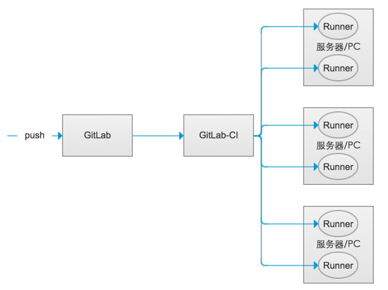
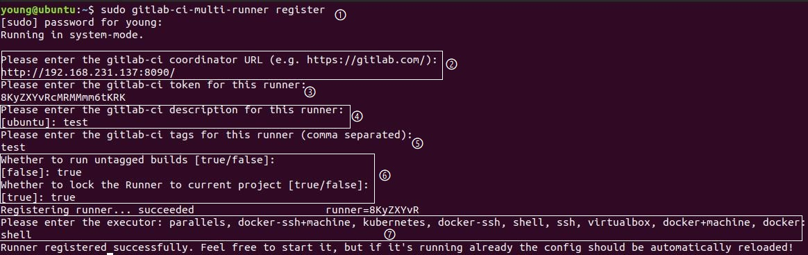

# 在Gitlab Pages上部署静态网站

## 一、Gitlab Pages功能
用来发布静态网站，并且是自动化地更新发布。每次有文件提交到Gitlab上，Gitlab Pages都会自动构建并发布更新网站。该功能的基础是Gitlab提供的持续集成的功能。Gitlab的持续集成功能主要由gitlab-ci和gitlab runner实现。gitlab-ci负责调度、触发 Runner，以及获取返回的结果，无需用户配置；gitlab runner负责执行自动化 CI 的宿主，需要用户自己配置，Runner 可以存在多个。


## 二、准备
### 1、Gitlab开启Pages功能
编辑 /etc/gitlab/gitlab.rb文件，修改如下两行
```
pages_external_url "http://www.example.com/"
gitlab_pages['enable'] = true
```
注意的这里的pages_external_url，配置的是Pages使用的域名。如果你没有域名，就先随便写个主机名什么的。之后我们可能通过配置Nginx来解决。<br/>
通过 gitlab-ctl restart 重启GitLab，使得GitLab Pages功能生效。

### 2、安装Gitlab Runner
gitlab-ci是gitlab自带的，所以我们只需要安装gitlab runner即可。<br/>
在Linux环境下安装gitlab runner，输入以下命令即可
```
# For Debian/Ubuntu
sudo apt-get install gitlab-ci-multi-runner

# For CentOS
sudo yum install gitlab-ci-multi-runner
```

### 3、注册Gitlab Runner
➀使用 sudo gitlab-ci-multi-runner register 开始测试<br/>
➁输入gitlab的地址<br/>
➂输入gitlab-ci的token<br/>
➃输入gitlab runner的描述<br/>
➄输入gitlab runner的标签<br/>
➅都选择true<br/>
➆此处可以选择shell<br/>

第二步和第三步中所需要的URL和token需要在gitlab服务器上获取


### 4、编辑.gitlab-ci.yml
在项目的根目录下，创建.gitlab-ci.yml文件，根据项目需要编辑脚本。

以下是本系统的例子
```
image: node:latest

pages:
  script:
  - cd docs-www
  - yarn install
  - yarn run build
  - mkdir .public
  - cp -r public/* .public
  - mv .public ../public 
  artifacts:
    paths:
    - public
  cache:
    paths:
      - ./docs-www/node_modules
  only:
  - master

```

### 5、提交
将.gitlab-ci.yml文件提交到Gitlab上后，以后有提交，gitlab-ci都会自动进行构建打包发布。

