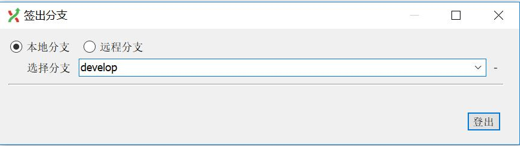
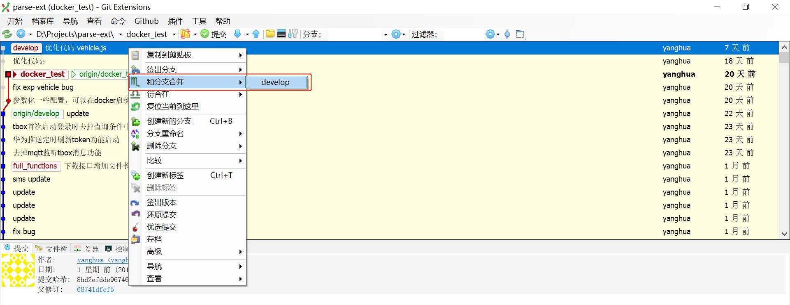

# 常用功能介绍

## 1、克隆/clone
  >  
  将工程从远程代码库下载到本地，本地会建立一个相同的代码库。  
  
  
  ➀远程代码库的地址  
  ➁本地代码库的路径  
  ➂本地代码库的文件夹  
  ➃克隆的分支，默认是master分支  
## 2、提交/commit
  >  
  将修改后的内容提交到本地代码库。
  
  此为提交界面
  
## 3、拉取/pull
  >  
  从远程代码库获取最新代码，需要注意本地文件可能会被远程的文件所覆盖。  
  有两种拉取模式，分别为合并和衍合。一般使用合并模式。  
  
## 4、推送/push
  >  
  将本地代码库推送到远程代码库中。
  
## 5、创建分支
  >  
  在提交记录中选择后，从该处创建一个新的分支，创建成功后，会自动进入到新分支中  
  
  
## 5、登出分支
  >  
  即变更到某个分支  
  
  在签出分支界面，输入或者选择新的分支名称，点击登出以即可。
  
## 6、合并分支
  >  
  将某个分支合并到当前分支  
  
  
  ➀选择合并的分支，合并后该分支不会变化  
  ➁被合并的分支，合并和该分支内容会有变化  
## 7、解决冲突
  >  
  //TODO
## 8、在命令菜单，也可以使用命令
  >  
  
