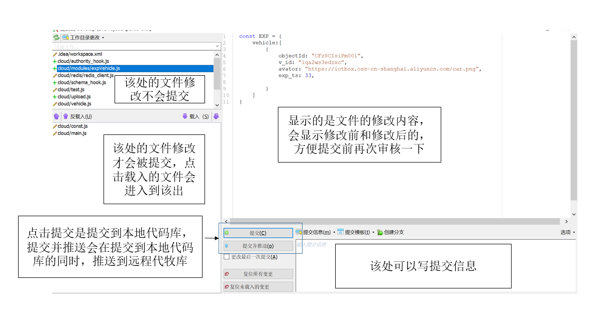

#gitextensions使用说明 

##一、简介
  >  
  Git Extensions 是一个 Git 的图形化客户端，用来控制 Git 资料库，支持 Windows 资源管理器集成和 Visual Studio 集成。（摘自oschina）  
  支持系统：Windows / Linux  （免费软件）  

##二、下载地址
  >https://sourceforge.net/projects/

---

##三、安装
  >  
  1、点击安装包，选择默认，点击确认  
  2、进入如下界面，可选安装。如果未安装git，可以勾选Install Git;KDiff3是在Merge代码时使用的，没有安装也可以勾选Install KDiff  
    
  3、之后一路默认即可。  
  4、安装完成后，Git Extensions会检测配置的正确性，如果不正确，会显示红色。只需依据提示重新配置即可。一般第一次安装会有几个是红色的，合并工具、差异比较工具，git以及用户名和邮件需要手动配置。合并工具、差异比较工具只需配置KDiff3的安装路径  
    
  5、配置正确后，关闭该窗口，就会进入软件主窗口。  
  6、如果想再次打开配置界面，点击工具 --> 设置，即可打开。  
    

---

##四、使用
  >  
  1、进入主界面，左边分为公共操作和最近打开的档案。公共操作中的克隆档案库，可以从服务器下载克隆代码到本地。  
     
     
  2、打开一个工程，主要使用的地方如下图：  
     
  3、点击提交，会进入如下提交页面：  
     
  4、一般在提交到本地代码库后，需要先pull一下，将远程代码库的最新代码合并到本地，如果有冲突，需要解决一下。解决完后，再提交远程代码库。  
  5、点击命令，可以出现一些git命令，常用的有提交、拉取(pull)、推送(push)、复位变化、创建分支、登出分支、合并分支、解决合并冲突、创建/删除标签  
     
  提交：提交代码，会进入提交界面  
  拉取(pull)：从远程拉取代码  
  推送(push)：推送本地代码到远程  
  复位变化：将代码回滚，一般不使用  
  创建分支：在提交记录中选择后，从该处创建一个新的分支  
  登出分支：即变更到某个分支  
  合并分支：将某个分支合并到当前分支  
  解决合并冲突：一般是在拉取时，有冲突则需要解决一下  
  创建/删除标签：创建/删除标签，一般是用来做版本的  

---

##五、合并冲突时的乱码问题
  >  
  解决合并冲突时，可能会出现因为字符编码格式不匹配造成的乱码现象。需要将解决冲突的文本工具KDiff3的编码格式设置一下。打开KDiff3工具，打开设置，选择Regional Setting，设置File Encoding为统一格式，一般使用UTF-8。
  

---

##六、SSH协议
  >
  1、进入git bash，检查是否已生成 id_rsa.pub 或 id_dsa.pub 文件，如果文件已经存在，那么你可以跳过步骤2  
     
  2、生成SHH key   
     
   直接回车，不需要输入即可  
     
     
     
  3、将生成的ssh key放到gitlab上，进入gitlab的ssh key管理界面  
     
  复制id_rsa.pub中的内容，粘贴到输入框中，点击add key上传key  
     
  打开git extensions的设置，将SSH设置成openssh，之后即可使用  
     
