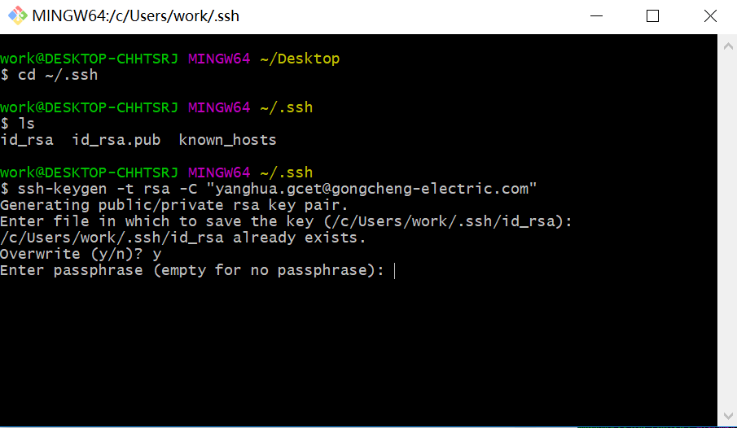
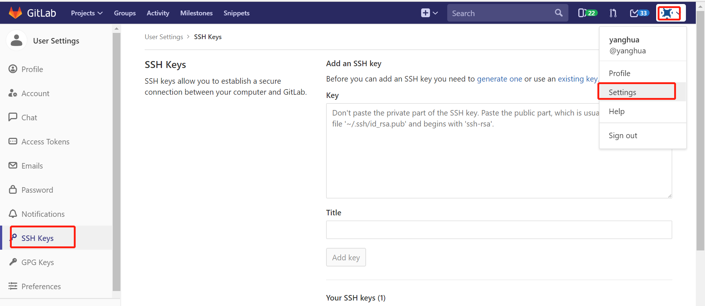

# 配置SSH协议

## 一、SSH协议
  >  
  gitlab支持除了HTTP的协议外，还支持SSH协议。如果要传输大容量文件，必须使用SSH协议。gitextensions支持两种客户端PuTTY、OpenSSH，我们使用OpenSSH客户端通信。

## 二、配置SSH协议
  >
  1、鼠标右击选择GIT BUSH HERE，进入git bash，检查是否已生成 id_rsa.pub 或 id_dsa.pub 文件，如果文件已经存在，那么你可以跳过步骤2  
     
  2、生成SHH key   
     
   直接回车，不需要输入即可  
     
     
     
  3、将生成的ssh key放到gitlab上，进入gitlab的ssh key管理界面  
     
  复制id_rsa.pub中的内容，粘贴到输入框中，点击add key上传key  
     
  打开git extensions的设置，将SSH设置成openssh，之后即可使用  
     
