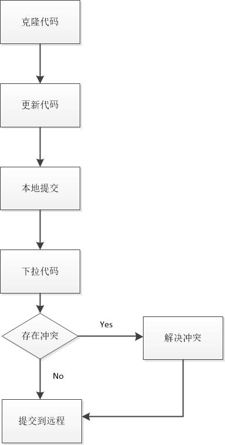

# 常用使用流程

## 一、一般提交流程
  >  
  从远程代码库克隆至本地，在本地提交更新信息，最后提交到远程。  
  1、使用克隆功能将远程代码库克隆至本地  
  2、在本地更新代码，点击提交  
  3、使用提交功能将修改后的代码提交到本地代码库  
  4、使用推送功能将本地的变更提交到远程代码库  
  

## 二、代码合并流程
  >  
  团队开发时，可以保留master分支为稳定版本，develop分支为开发稳定版本。当开发新功能时，可以在develop或者master分支上创建功能分支，功能分支开发测试结束后，再合并至主分支中。  
  1、使用创建分支功能在主分支上创建新的分支。  
  2、待新分支开发完毕，使用合并分支功能将新分支合并进主分支中  
  3、如果合并时提示存在冲突，则需要解决冲突  
  4、最后，在主分支上，使用推送功能将本地的变更提交到远程代码库  

## 三、
