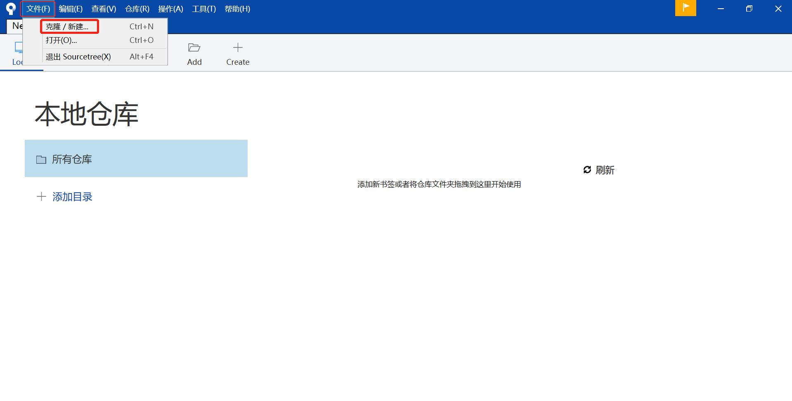
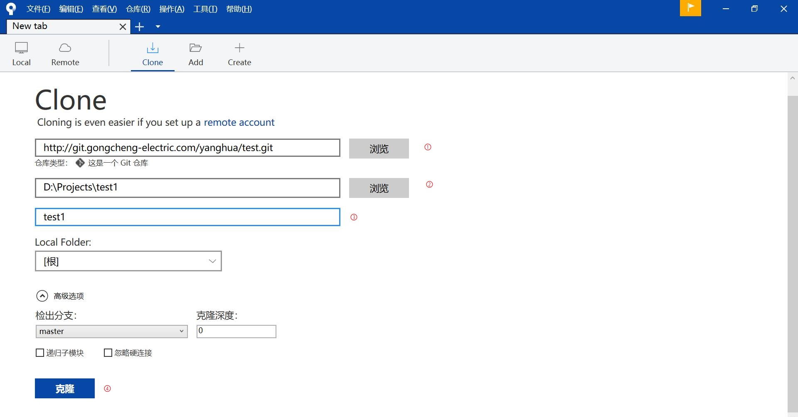
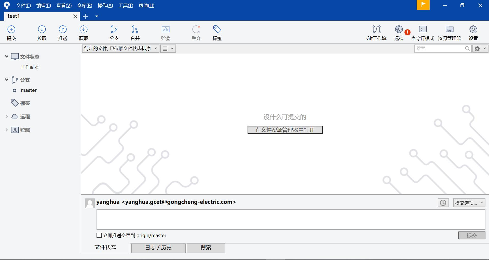
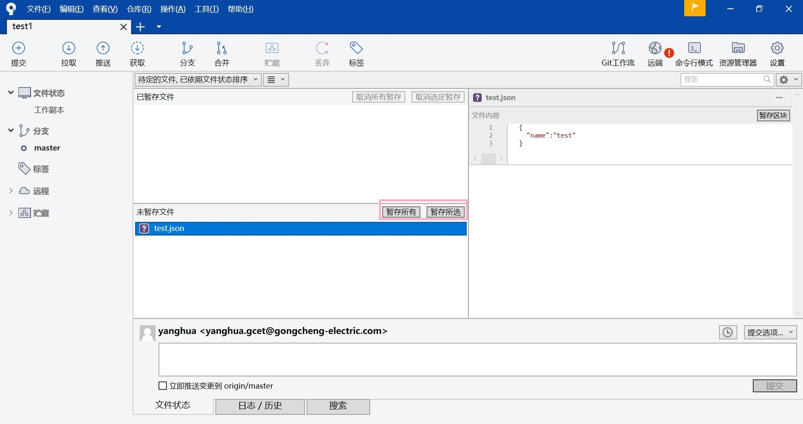
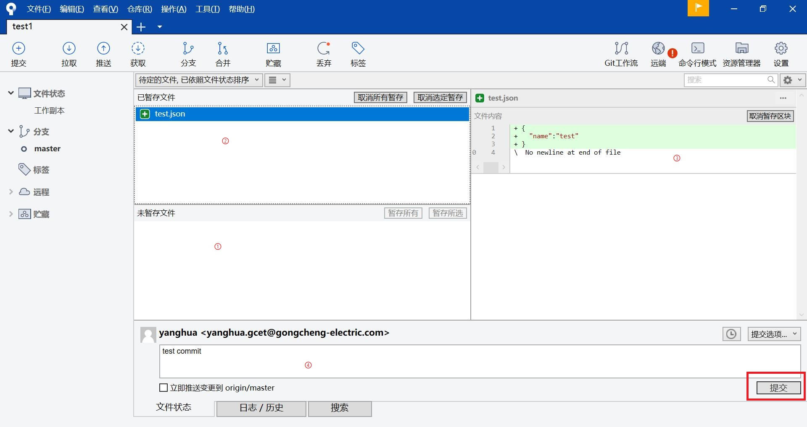
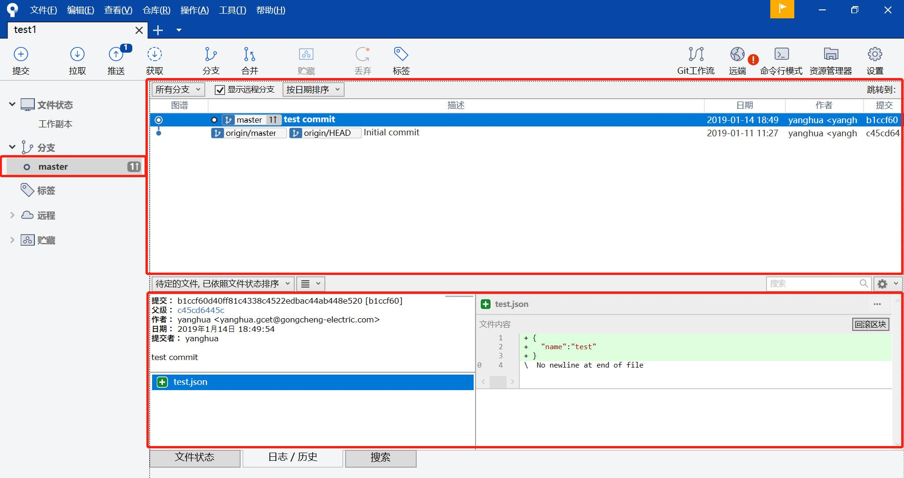
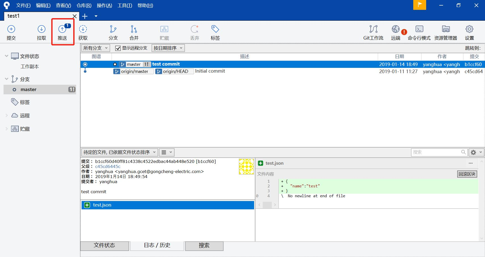
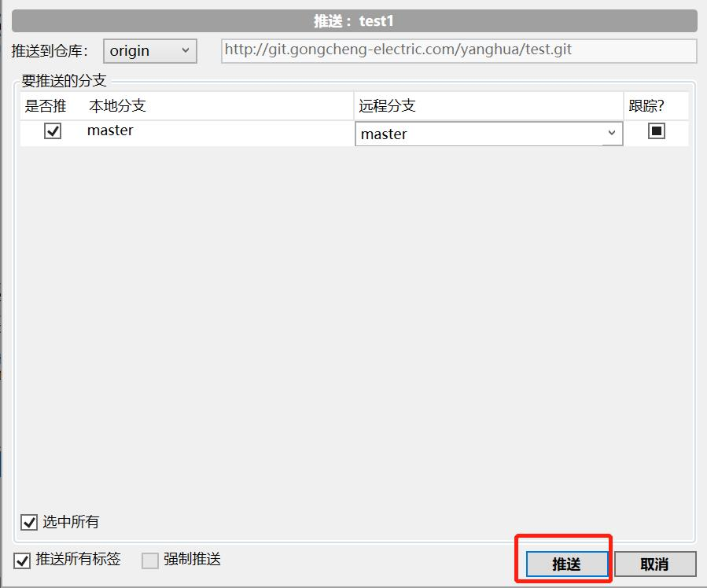
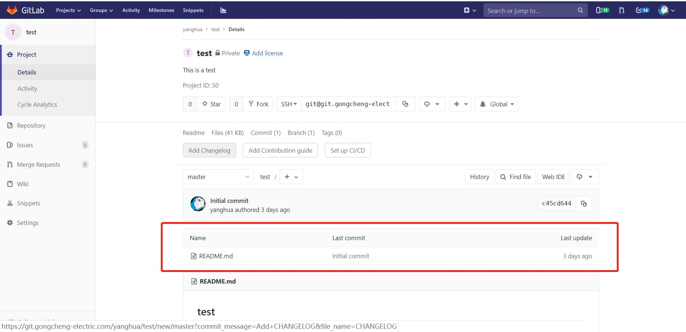
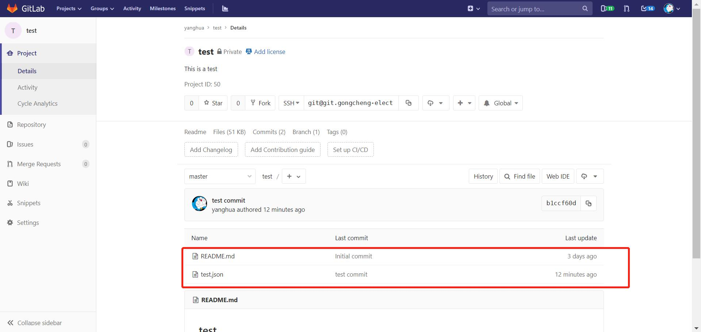

# Git、SourceTree和Gitlab三者之间关系
> 简单来说，Gitlab是存储在远端的代码，git是本地代码与远端代码沟通的桥梁，但git是完全命令行模式，对于新手来说操作不便，而SourceTree则是git的界面化的Git客户端，使用起来更加便捷。
# gitlab与sourcetree使用入门
## 一、目标
>  
在gitlab上创建一个新项目，并使用sourcetree克隆至本地，在本地更新内容后，推送到gitlab上。

## 二、gitlab操作。
>  
在gitlab上创建一个新的项目，参考gitlab中的简单使用。

## 三、sourcetree操作
>  
1、在gitlab的项目页面复制项目的URL，此处使用HTTP协议的URL  
2、打开sourcetree，使用克隆功能


➀项目的URL
➁克隆的本地路径，如果未创建，需要提前创建  
➂文件夹名称，一般与项目名称一致  
➃点击确认  
等待项目克隆成功，进入项目页面  

4、在项目中创建一个文件，如test.json，在其中添加如下  
````
{
  "name":"test"
}
````
>  
可以看到sourcetree中会出现该文件的信息

选中test.json，点击暂存所有或暂存选中，则test.json会变成待提交文件。

➀未暂存区，此处的文件在提交时不会被提交  
➁暂存区，此处的文件在提交会被提交  
➂此处显示文件的修改内容，有修改前和修改后的对比，方便用户在提交前最后审核一次  
➃本次提交的描述，一定要填写，否则无法提交  
点击提交，test.json会被提交到本地库  
左侧选择分支显示分支详情，可以查看该分支的提交历史，如下图中选择master分支，就显示了刚才的提交记录：

5、点击推送，弹出推送界面，点击推送，即可将本地修改内容推送到远程


6、登陆gitlab，可以看到项目中多出了一个test.json文件  
推送前：
推送后：
