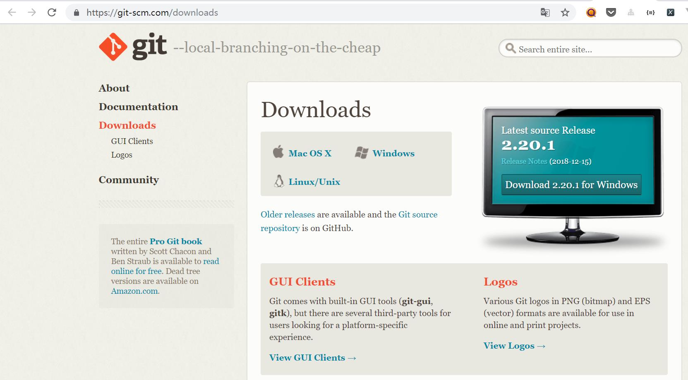

# Git介绍

## 一、简介
  >  
  Git(读音为/gɪt/。)是一个开源的分布式版本控制系统，可以有效、高速地处理从很小到非常大的项目版本管理。

## 二、安装
### 1、下载地址
  >  
  https://git-scm.com/downloads  
  支持Linux、Mac、Windows系统，选择对应系统的版本即可：  
  
### 2、安装
#### 在windows下安装
  >  
  双击打开安装包，一路Next，使用默认即可。
#### 在linux下安装
  >CentOS：yum install git-core  
  
  >Ubuntu：apt-get install git  
