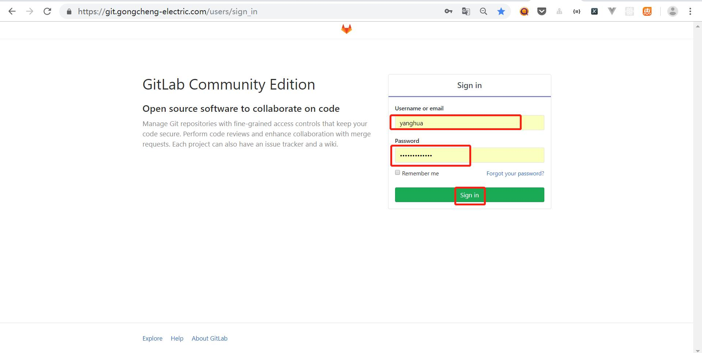
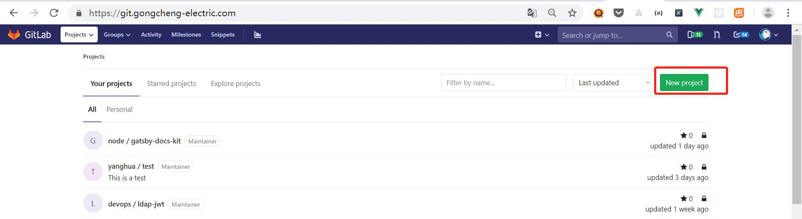
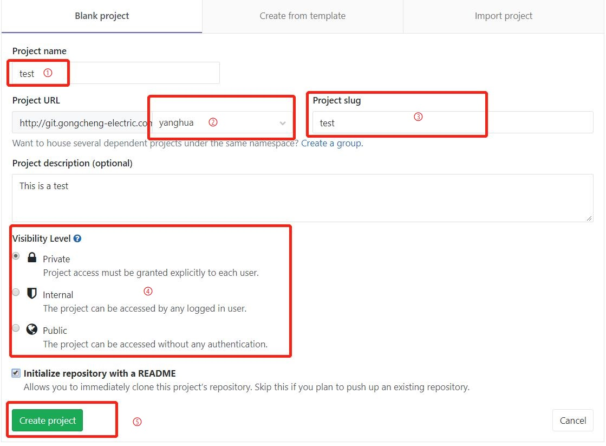
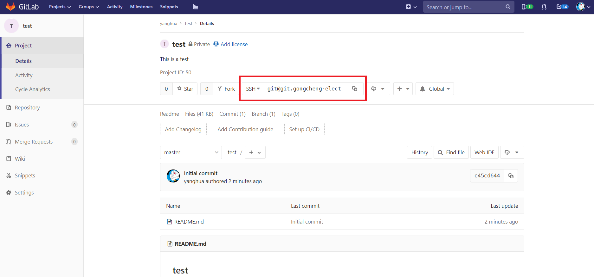

# gitlab介绍

## 一、简介
  >  
  GitLab 是一个用于仓库管理系统的开源项目。使用Git作为代码管理工具，并在此基础上搭建起来的web服务。  
  可通过Web界面进行访问公开的或者私人项目。它拥有与Github类似的功能，能够浏览源代码，管理缺陷和注释。可以管理团队对仓库的访问，它非常易于浏览提交过的版本并提供一个文件历史库。团队成员可以利用内置的简单聊天程序(Wall)进行交流。它还提供一个代码片段收集功能可以轻松实现代码复用。   

  >  
  当前公司的gitlab地址为：https://git.gongcheng-electric.com/

## 二、简单使用
  >  
  1、向管理员申请分配账号  
  2、登陆gitlab地址，使用分配的账号密码登陆  
  
  3、创建新项目  
  
  进入创建页面
  
  ➀项目名称  
  ➁选择项目所在的组  
  ➂是项目仓库更为友好的URL，一般与项目名称保持一致即可，填写项目名词时，也会自动填充  
  ➃可见性（库类别）  
  私有库(Private)：只有被赋予权限的用户可见  
  内部库(Internal)：登录用户可以下载  
  公开库(Public)：所有人可以下载  
  ➄填写好以上信息后，点击create即可创建  
  3、创建成功后，进入项目页面  
  
  红框标注处为项目的URL，有SSH和HTTP两种类型。SSH需要客户端上传SSH密钥，HTTP只要复制地址即可使用客户端克隆下来   
