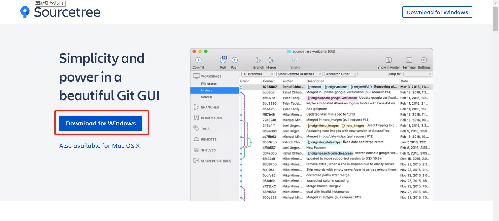
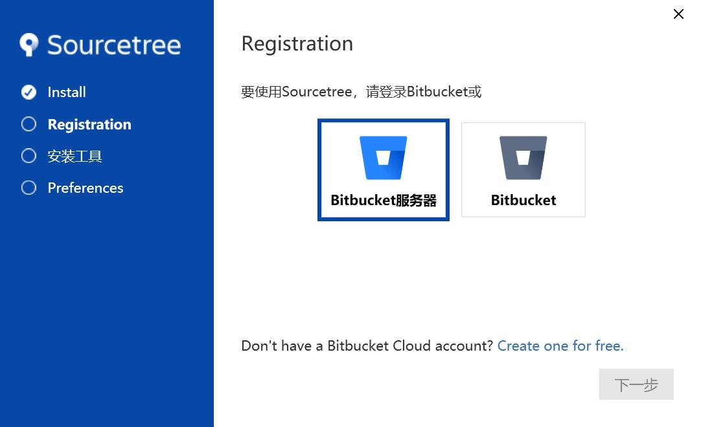
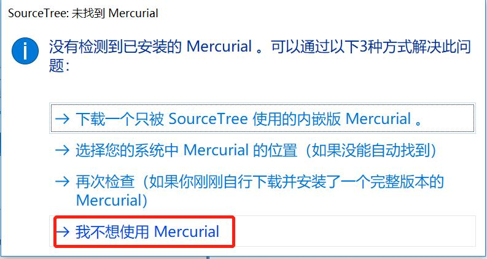
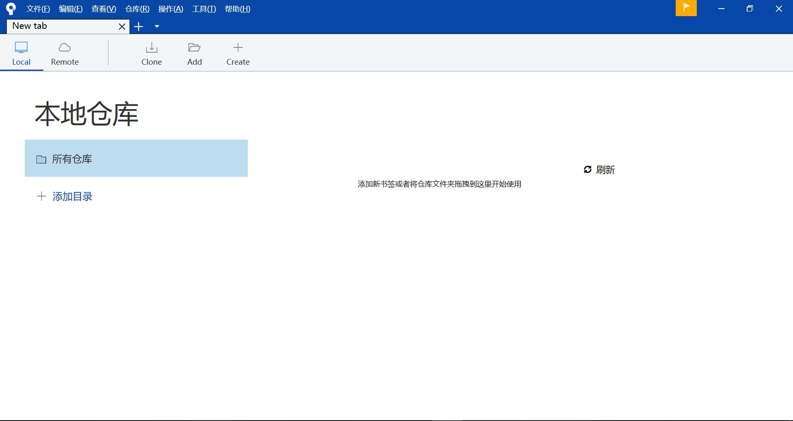

## SourceTree简介

SourceTree 是 Windows 和Mac OS X 下免费的 [Git](http://lib.csdn.net/base/git "Git知识库") 和 Hg 客户端，拥有可视化界面，容易上手操作。同时它也是Mercurial和Subversion[版本控制](http://lib.csdn.net/base/git "Git知识库")系统工具。支持创建、提交、clone、push、pull 和merge等操作。

## 免注册安装过程

1、保存电脑上已经安装了Git工具。
2、下载windows版本的sourceTree。直接进入官网https://www.sourcetreeapp.com/  下载  

  
  
3、双击安装包，弹出安装程序：  

  

由于这两者的账户都是需要外网的连接，所以推荐以下方式。  
在C:\Users\你的用户名\AppData\Local\Atlassian\SourceTree目录下新建accounts.json文件，输入如下内容：  

```
[  
  {  
    "$id": "1",  
    "$type": "SourceTree.Api.Host.Identity.Model.IdentityAccount, SourceTree.Api.Host.Identity",  
    "Authenticate": true,  
    "HostInstance": {  
      "$id": "2",  
      "$type": "SourceTree.Host.Atlassianaccount.AtlassianAccountInstance, SourceTree.Host.AtlassianAccount",  
      "Host": {  
        "$id": "3",  
        "$type": "SourceTree.Host.Atlassianaccount.AtlassianAccountHost, SourceTree.Host.AtlassianAccount",  
        "Id": "atlassian account"  
      },  
      "BaseUrl": "https://id.atlassian.com/"  
    },  
    "Credentials": {  
      "$id": "4",  
      "$type": "SourceTree.Model.BasicAuthCredentials, SourceTree.Api.Account",  
      "Username": "",  
      "Email": null  
    },  
    "IsDefault": false
  }  
]  

```


 
4、关闭安装程序，再次打开安装包，进入如下界面，选择第四个选项  

  

5、安装成功，进入主页  

  


