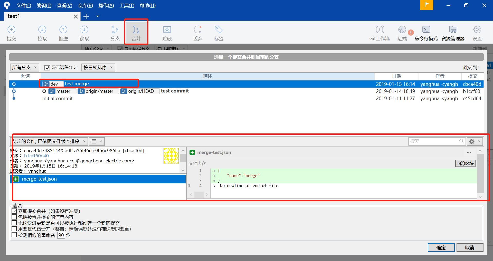

# 功能描述
合并分支功能可以将一个分支的代码合并如另一个分支中，如果两个有冲突，需要先解决冲突，才能完成合并。合并完成后，第二个分支将包含第一个分支的所有内容，第一个分支保持不变

# Sourcetree 合并功能
如下图，有master与develop两个分支，现在将develop分支合并如master分支  

  

1、需要将当前分支切换master分支  
2、点击菜单中的合并，会弹出合并界面，选择想要合并的分支（该分支不会变化），点击确认，即可进行合并  

  

3、合并成功，会跳回主界面，能够看出master已经有的变化，已经合并分支的记录  

  

