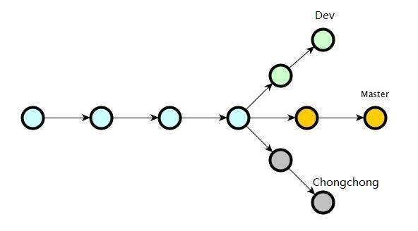
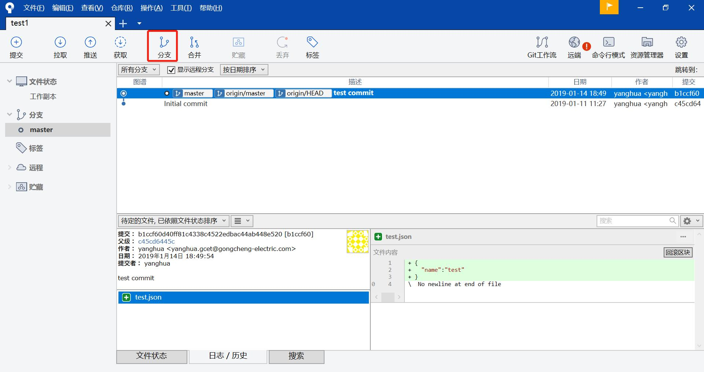
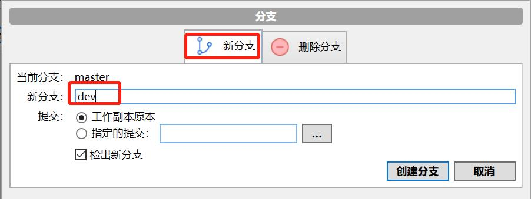
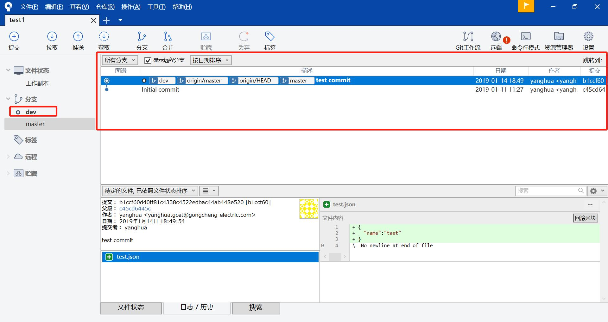

## 一、分支介绍

  

图上显示有三个分支Master、Dev和Chongchong。  

其中Master是默认就存在的一个分支，我们叫它主分支。Master和其他分支一样没有啥特殊之处，之所以几乎每一个仓库都有 master 分支，是因为 git init 命令默认创建它，并且大多数人都懒得去改动它。  

使用分支意味着你可以把你的工作从开发主线上分离开来，保持主分支的稳定性。新特性和BUG修改都可以在不同的分支上进行开发和测试，这样规范了整个软件的开发流程。分支之间的互不影响这种特性可以增加团队合作的效率。  

## 二、sourcetree上创建分支
1、点击分支，进入分支界面  

  

2、选择新分支，输入新分支名称，点击创建分支  

  

3、分支创建成功，sourcetree会自动切换到新建分支中  

  

## 三、分支实践

1、主要分支  
* master：用来最终上线的分支，最终发布版本，整个项目中有且只有一个  
* develop：项目中用来开发的分支，原则上项目中有且只有一个，develop 分支下面的分支是经常变化的，会创建新的分支，会删除分支  

2、从develop创建的分支
* feature：功能分支，用于开发一个新的功能，从develop分出来进行开发，一般多人协作开发每人负责一个功能，开发完成后，合并入develop分支  
* fix：用来修复一些不紧急的bug，一般针对已经上线的功能产生的缺陷，修改完成后，合并入develop分支  
* release：当发布一个重大更新版本时，从develop分支创建出来，允许有功能的微小改动和bug的修复，禁止重大变更，在测试完成后，合并入master分支，此时master可以大上一个tag，作为新版本发布  

3、从master创建的分支  
* hotfix：用于紧急修复bug，从master分出来，修复完，合并到master产生tag，一般是用版本号第三位表示，比如：2.2.1。最后合并回develop分支继续开发
