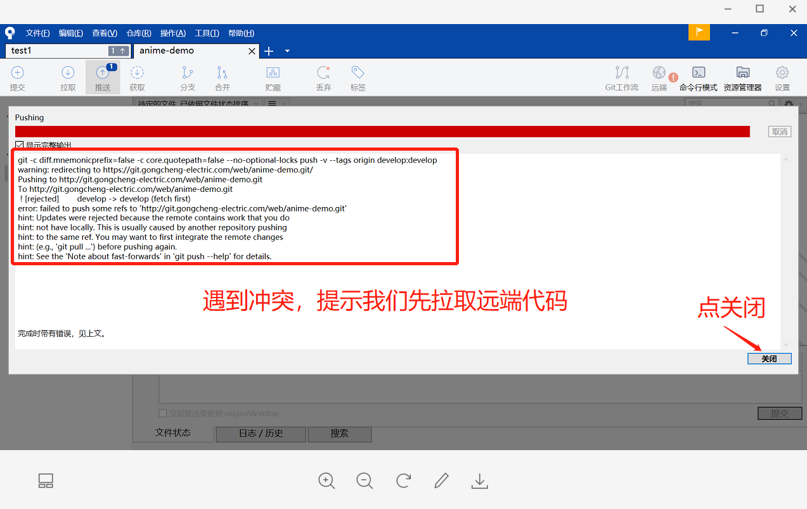

# 模拟冲突

* A 修改了index.html文件中的内容并且提交推送到git上  
* B 这个时候也修改了index.html文件中的内容准备提交推送，这个时候git就会提示远程已经有更新了，本地版本太低，让我们先拉取最新的代码  

  

  

# 解决冲突

1、我们点击拉取代码，这个时候由于本地有修改这个文件，就会在本地产生冲突文件  
2、点击关闭  

  

3、显示冲突文件  

  

4、在本地仓库中找到该文件用编辑器打开  

  

5、在文件中查找所有的 `<<<<<<< HEAD` 标记 `=======` 标记 `>>>>>>>` 标记然后全部删除，`>>>>>>>` 之后的一串数字和字母的组合是要合并过来的分支的名称,也要删除。  

  

6、操作完之后我们再回到 Sourcetree 工具上  
7、点击暂存所有或在暂存所选按钮  

  

8、编辑版本描述，点击右下角提交就可以提交到本地仓库啦  

  
  

9、推送到远程仓库，这时点推送便不会再提示遇到冲突并能成功推送至远端仓库，冲突完美解决。  

  

10、远端仓库效果图  

  

