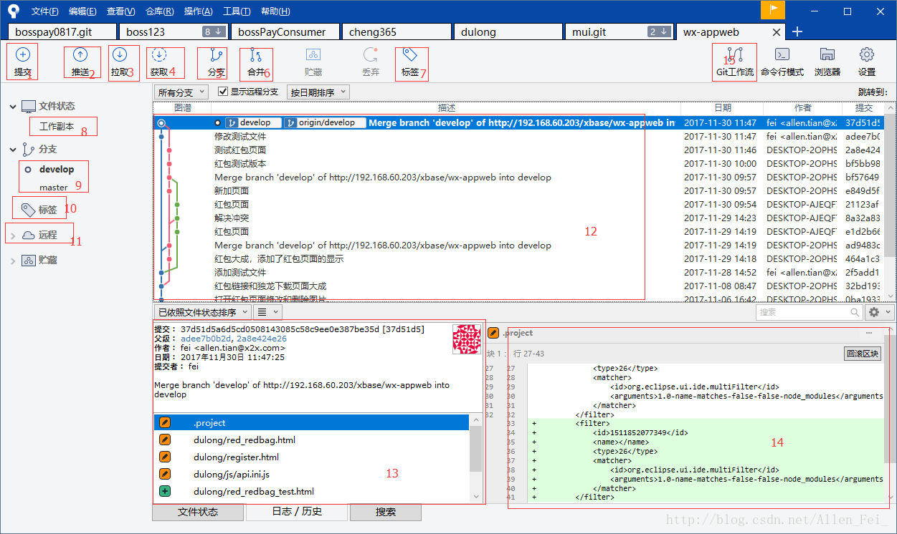

# Sourcetree 常用功能
 

  

按照图中标注与图解一一对应  

# 图解  
1、提交（提交代码到本地仓库，在拉取代码之前先提交本地修改过的文件）  
2、推送（提交完之后，就利用推送，把本地库所修改的推送到服务器对应项目）  
3、拉取（拉取服务器上git库代码到本地库）  
4、获取（获取服务器上的变更，包括分支、标签等，如果服务器上有变更，对应的菜单上会有相应的数标出现 ）   
5、分支（可以在本地库创建分支，删除分支）   
6、合并（合并分支，先在图标9处选择要合并到的分支，再选择12处选择要合并到的点）   
7、标签（给分支中的某个点添加标签，可以用来记录版本）   
8、工作副本（显示修改了还未提交的文件，或拉取时冲突的文件）   
9、分支（显示本地库的分支）   
10、标签（显示本地标签）   
11、远程（显示远程服务器库分支及标签）   
12、日志列表（显示当前分支提交的日志列表）   
13、日志详情（显示某个日志的详情，也就是显示当前日志所修改的文件）   
14、文件详情（显示左边单个文件所修改的内容详情）   
15、工作流（当开发新功能时利用这个工作流，可很好的管理本地分支，后面详细介绍）   

注：除以上之外，还有一些设置、命令行模式、贮藏、丢弃等等。

