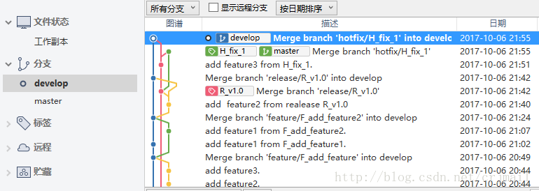
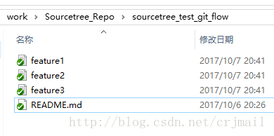
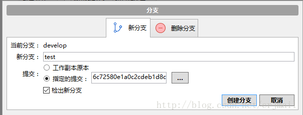
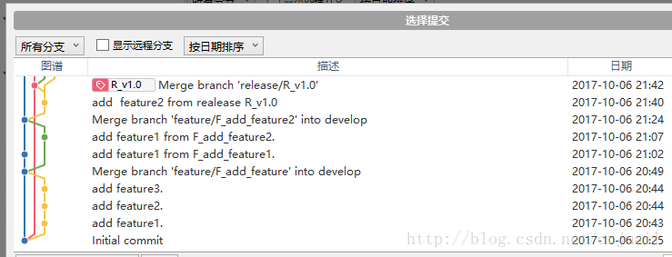
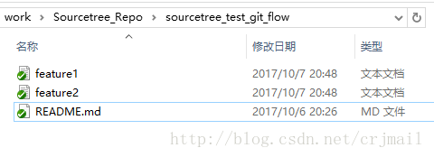

# Sourcetree 版本回退

假设我们在开发过程中想回退到某一次提交，或者说只是想在我们曾经的某一次提交的版本上做某一项测试，那么我们只需要检出新的分支即可。  

  

现在处于develop分支下，工作区中有以下文件：  

  

现在，假设我们想回退到最初的版本。点击分支，选择新分支–制定的提交。  

  

可以在这里选择你想回退的版本。  

  

查看工作目录下的文件,可以看到该分支下的文件即为回退的版本的文件。  

  

 

