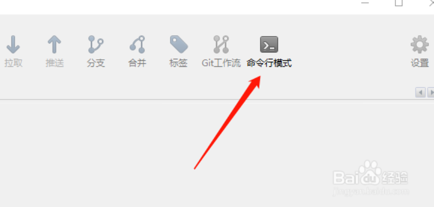
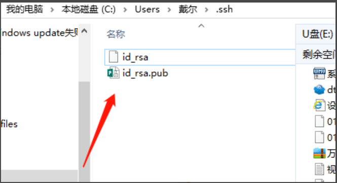
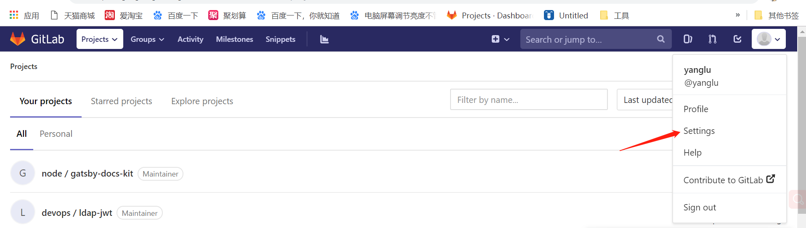
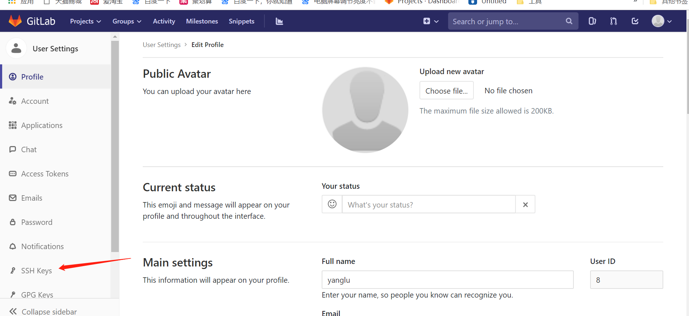
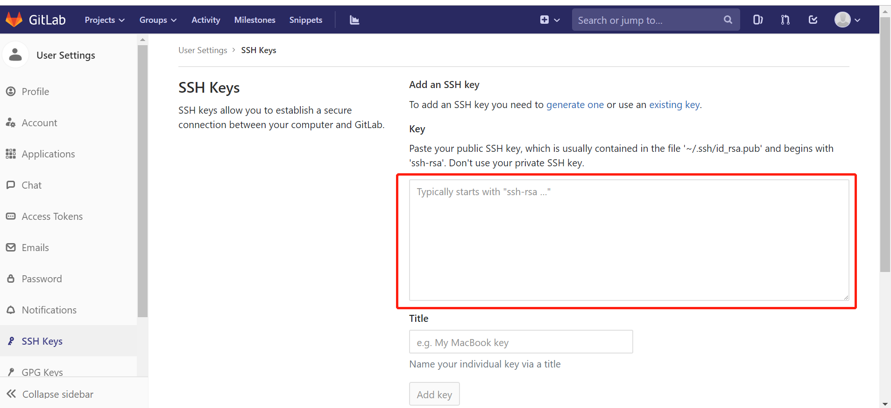
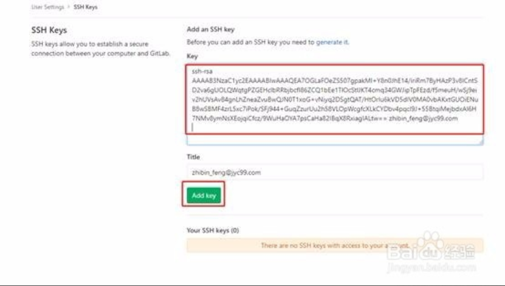

# 前言： 
SSH是目前较可靠，转为远程登录会话和其他网络服务提供安全的协议。利用SSH协议可以有效防止远程管理过程中的信息泄露问题。  
Git就采用了SSH加密传输协议，加密传输的算法有很多，git可以使用RSA，RSA的核心就是使用一对特定的数字，使用其中一个数字可以用来加密，而另外一个数字可以用来解密。这两个数字就是你在使用git、gitlab的时候所遇到public key 也就是公钥以及private key 私钥。公钥是用来加密的数字，这也就是为什么本级生成了公钥之后，要上传到gitlab的原因。从gitlab发回来的用公钥加密过的数据，可以用你本地的私钥来还原。  
如果key丢失，不管是公钥还是私钥，丢失哪一个都不能用，需要重新生成一次然后在gitlab账户中再设置一次就可以了。  
下面就讲一下如何生成SSH KEYS。

# 如何生成SSH KEYS
> 1、打开sourcetree工具选中右上角的命令行模式

> 2、在命令行中输入以下命令生成gitlab服务端和本地git所需要的公钥和私钥：  
`ssh-keygen -t rsa -C “邮箱地址” `   
> 这里的邮箱地址是指你申请成功的gitlab邮箱账号,输入完成后直接按两下Eenter键即可。  
> 3、这时你会发现C盘当前用户目录下多了一个.ssh文件夹，打开.ssh文件夹会发现两个文件id\_rsa和id\_rsa.pub  

> id\_rsa就是私钥，id\_rsa.pub是公钥。    
> 4、用记事本将公钥打开，复制公钥里面的内容 ，然后找到gitlab--->SSH Keys--->Key  
如何找看下图：  
（1）首先登录你的gitlab账号（没账号的去注册 gitlab注册()），登录成功后，鼠标点击右上方头像会出现一个下拉菜单，  
  
（2）点击 Settings，进入到下个界面  
   
（3）在左侧导航栏中便能看到 SSH Skeys，点击 SSH Skeys 进入下个界面，  
  
（4）将复制好的公钥粘贴至红框处  
  
粘贴之后Title中会显示你的邮箱账号（该title是可以随意命名的）。完成之后点击Add key按钮。到这里gitlab端的公钥就配置好了

