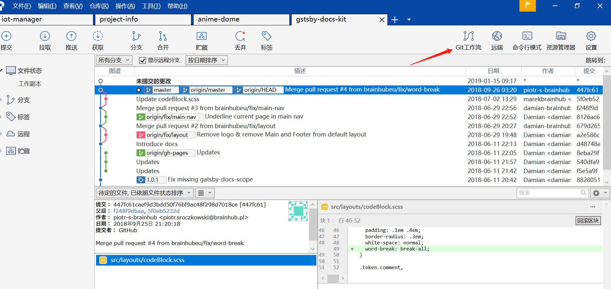
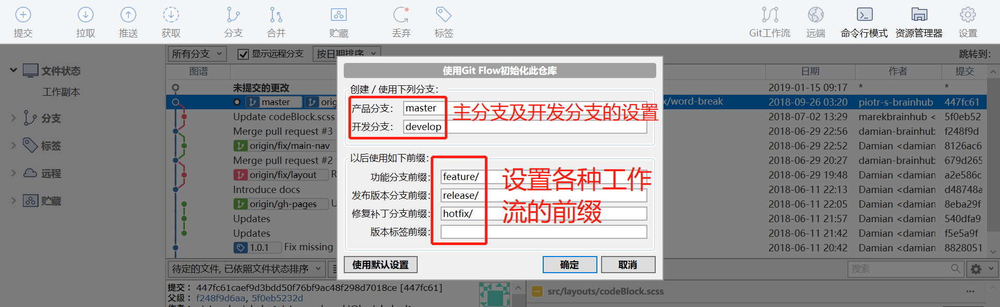
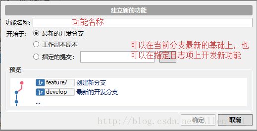
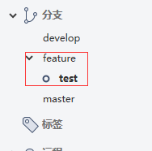
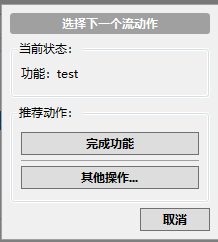
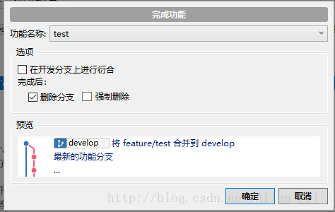

# SourceTree工作流 
1、点击git工作流  

  

2、当第一次点击时，会出现下图界面（配置界面，可以配置产品分支、开发分支，以及各类型分支的前缀）  

  

3、配置好后再点击git工作流时，将选择你下一步将要做的模块，比如我要开发一个新的功能，就点击建立新的功能  

  

4、当选择新的功能后，会自动生成一个分支（带有前面配置的前缀的分支）  

  

5、当添加完成后，左边的分支列表会多出一个feature，这个名字就是我们前面配置功能分支前缀的默认值，在它下面会有一test分支，test就是功能分支的名称了   

   

注：如此就可以在此状态下开发功能了。  

6、当开发完成后，再点击git工作流，会弹出一个框，选择“完成功能”然后直接确认  

  

注：以上操作完成后，再看左边分支，工作流的分支不见了，自动合并到了我们的develop开发分支  

 

