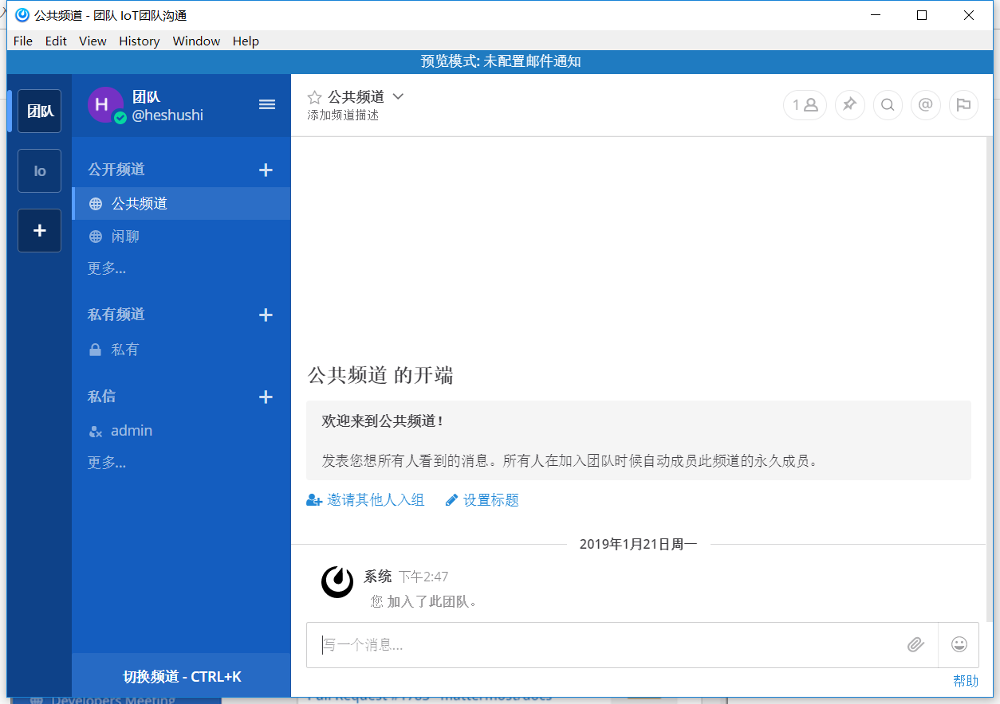

# 初次使用
首先要配置Mattermost服务器ip以及备注：

进入登陆界面，选择gitlab第三方登录：

输入账号密码登陆成功：

这是Mattermost客户端的样子：

要了解Mattermost的工作原理，下面列出了Mattermost的主要功能以及如何使用它们的说明：
* 小组
* 通道
* 消息
* 搜索
* 通知

## 团队
团队是一个数字工作区，您和您的队友可以在Mattermost中进行协作。根据Mattermost在您的组织中的设置方式，您可以属于一个团队或多个团队。

您可以在位于应用程序左上角的团队边栏上的团队之间来回切换。

## 频道
频道用于组织不同主题的对话。它们位于Mattermost的左侧面板上。

有三种类型的频道：公共频道，私人频道和直接消息。

#### 公共频道：

公共频道向团队中的每个人开放。注册时，新的团队成员会自动添加到两个公共频道：Town Square和Off-Topic。

公共频道使用地球图标标识。

点击“公共频道”部分底部的“ 更多...”按钮，浏览更多要加入的频道！

#### 私人频道：

私人频道用于敏感主题，仅对选定的团队成员可见。私人频道的任何成员都可以添加其他成员。频道成员可以随时选择离开，但只有频道所有者或团队管理员才能删除其他成员。

私人频道有一个锁定图标。

#### 直接消息（DM）和群组消息（GM）

直接消息用于两个人之间的对话。群组消息是直接消息，其中包含三个或更多人之间的对话。两者都只对相关人员可见。

## 消息
发送消息和回复消息是让您的团队保持对话活跃的重要方法。您可以在发送邮件后编辑和删除邮件。您还可以在Mattermost中共享指向任何邮件的链接。

## 搜索
使用搜索框查找与您输入的搜索字词相匹配的邮件和回复。搜索您是当前团队成员的所有频道。

您还可以在此处使用搜索修饰符执行更高级的搜索。

## 通知
Mattermost中的通知提醒您未读消息和提及。

