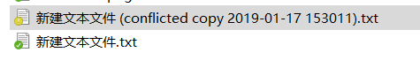

# 冲突
## 冲突概念
nextcloud桌面客户端上载本地更改并下载远程更改。当文件在本地端和远程同步运行之间发生更改时，客户端将无法自行解决该情况。它将使用本地版本创建冲突文件，下载远程版本并通知用户发生了需要注意的冲突。

## 举个栗子
想象一下，有一个名为`新建文本文件.txt`同步文件夹的文件。它暂时没有改变，并在本地和远程包含文本“内容”。现在，几乎在同一时间你在本地更新它以说出“本地内容”，同时服务器上的文件被更新为包含其他人的“远程内容”。

尝试上载本地更改时，桌​​面客户端会注意到服务器版本也已更改。它会产生冲突，您现在在本地计算机上有两个文件：

* `新建文本文件.txt` 包含“远程内容”
* `新建文本文件 (conflicted copy 2019-01-17 153011).txt` 包含“本地内容”
在这种情况下，文件`新建文本文件.txt`具有远程更改（并且当它们发生时将继续更新进一步的远程更改），但是您的本地调整尚未发送到服务器（除非服务器启用冲突上载，请参阅下文）。

桌面客户端通过系统通知，系统任务栏图标以及帐户设置窗口中的黄色“未解决冲突”徽章通知您此情况。单击此徽章会显示包含未解决冲突的列表，单击其中一个会打开一个指向相关文件的资源管理器窗口。

要解决此冲突，请打开这两个文件，比较差异并将本地更改从“冲突的副本”文件复制到适用的基本文件中。在此示例中，您可能会更改`新建文本文件.txt`为“本地和远程内容”并删除名称中包含“冲突副本”的文件。有了这个，冲突就解决了。