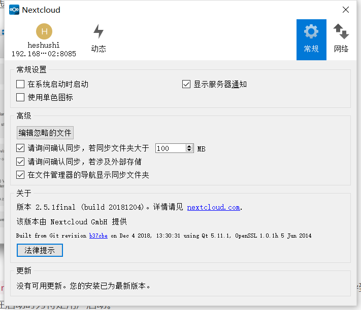

# 常规设置
“常规”窗口具有配置选项，例如“ 在系统启动时启动”，“ 使用单色图标 ”和“ 显示桌面通知”。在这里您可以找到编辑忽略的文件按钮，启动忽略的文件编辑器，并在下载大于文件夹大小的文件夹之前询问确认。

* 在系统启动时启动：一旦用户对其帐户进行了配置，此选项就会自动激活。取消选中该框将导致Nextcloud客户端无法在启动时为特定用户启动。
* 显示服务器通知：选中时，会在执行一组同步操作时提供气泡通知。
* 使用单色图标：使用不那么突兀的图标。特别适用于macOS。
* 关于：提供有关作者和构建条件的信息。提交支持请求时，此信息很有用。