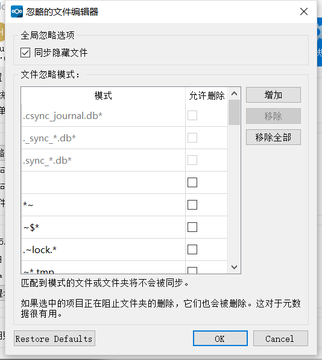

# 编辑忽略文件
Nextcloud Client能够从同步过程中排除文件。忽略的文件编辑器允许编辑应从同步过程中排除的文件或目录的自定义模式。

存在系统范围的默认忽略模式列表。无法在编辑器中直接修改这些全局默认值。使用鼠标悬停将显示全局排除定义文件的位置。

每行包含一个忽略模式字符串。在普通字符旁边，通配符可用于匹配由星号（`*`）指定的任意数量的字符或由问号（`?`）指定的单个字符。如果模式以斜杠字符（`/`）结尾，则该模式仅应用于要检查的路径的目录组件。

