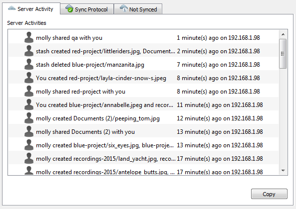
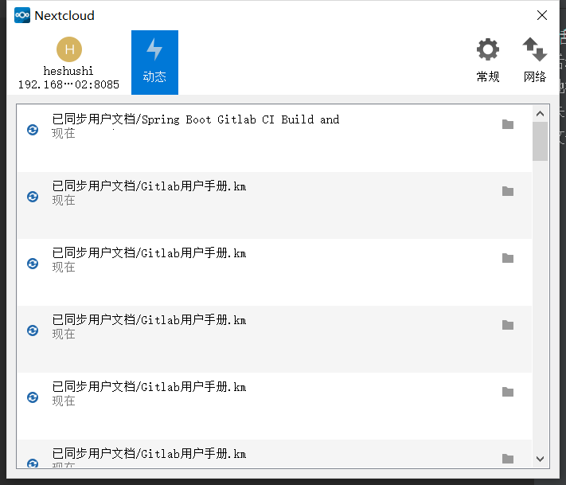

# 服务器通知
从2.2.0版开始，客户端将显示来自Nextcloud服务器的通知，这些通知需要您进行手动交互。例如，当远程Nextcloud上的用户为您创建新的联合共享时，您可以从桌面客户端接受它。

* macOS & linux：桌面客户端会自动定期自动检查可用通知。通知显示在“服务器活动”选项卡中，如果启用了“ 显示桌面通知”（“常规”选项卡），您还将看到系统托盘通知。

* windows：会和动态一起显示在同一界面内。

这还显示了Nextcloud管理员通过Announcements应用程序发送给用户的通知。