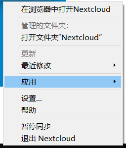

# 菜单

右键单击图标（左键单击Ubuntu和macOS），提供以下菜单：
* 在浏览器中打开nextcloud：打开nextcloud web页面。
* 打开nextcloud文件夹：打开nextcloud同步主目录。
* 最近修改：显示通过同步操作修改的最后六个文件，并提供对同步状态的访问，该状态列出自上次重新启动Nextcloud Client以来的所有更改。
* 应用：在web页面中打开nextcloud的五大模块、文件、动态、相册、日历、Deck。
* 设置：提供对设置菜单的访问。
* 帮助：打开浏览器以显示此帮助。
* 同步开关：可以暂停同步和开启同步
* 退出：退出Nextcloud Client，结束当前正在运行的同步运行。