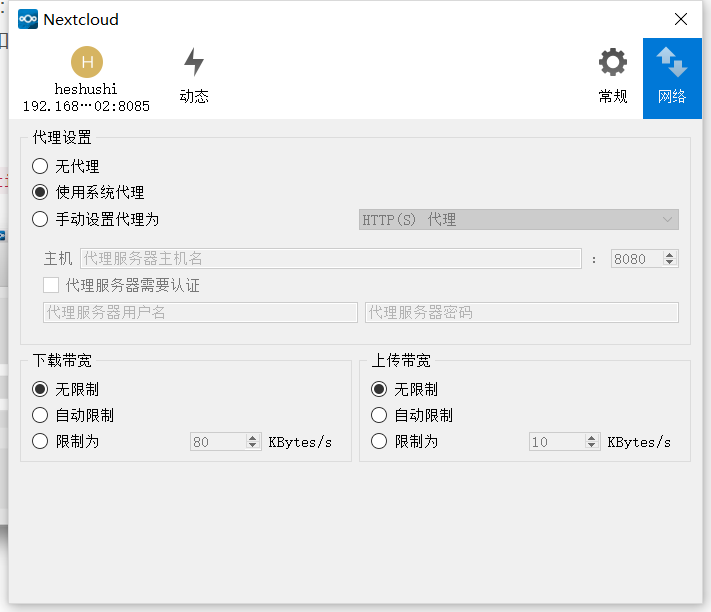

# 网络设置
通过网络设置窗口，您可以定义网络代理设置，还可以限制下载和上载带宽。

## 代理设置
* 无代理：如果Nextcloud客户端应绕过在系统上配置的默认代理，请检查此项。
* 使用系统代理：默认，将遵循系统代理设置。在Linux上，这只会获取变量的值http_proxy。
* 手动设置代理：允许指定自定义代理设置。如果您需要通过HTTP（S）代理服务器（如Squid或Microsoft Forefront TMG），请选择HTTP(S)。SOCKSv5另一方面，在特殊的公司LAN设置或与OpenSSH动态应用程序级转发功能相结合时尤其有用（请参阅参考资料）。ssh -D
* 代理主机：输入代理服务器的主机名或IP地址，然后输入端口号。HTTP代理通常侦听端口8080（默认）或3128. SOCKS服务器通常侦听端口1080。
* 代理服务器认证：应检查代理服务器是否允许匿名使用。如果选中，则必须提供用户名和密码。

## 带宽限制
下载带宽可以是无限制（默认）或仅限于自定义值。这是从Nextcloud Server流向客户端的数据可用带宽。

上传带宽，可用带宽或从Nextcloud客户端流向服务器的数据，还有一个额外的选项可以自动限制。

选中此选项后，Nextcloud客户端将把可用带宽交给其他应用程序。如果与Nextcloud客户端一起出现实时通信问题，请使用此选项。