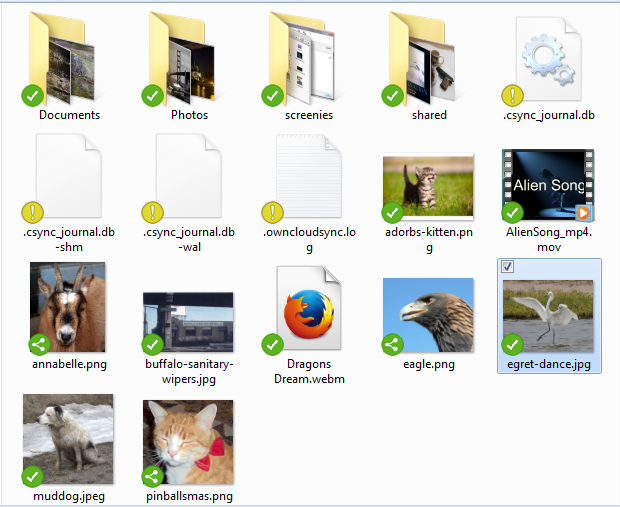
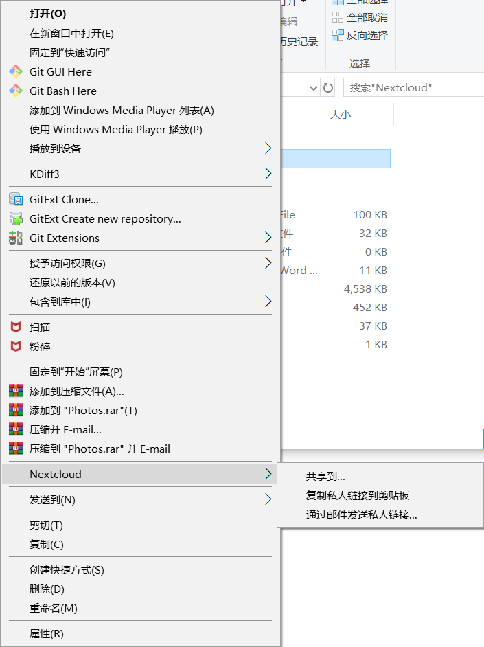
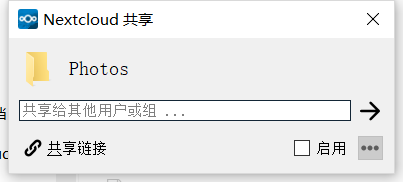
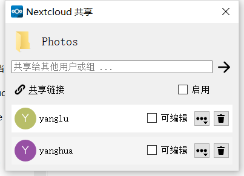

# 从桌面共享
Nextcloud桌面同步客户端与您的文件管理器集成：macOS上的Finder，Windows上的Explorer和Linux上的Nautilus。（Linux用户必须安装该`Nextcloud-client-nautilus`插件。）您可以创建共享链接，并以与Nextcloud Web界面相同的方式与内部Nextcloud用户共享。

右键单击系统托盘图标，将鼠标悬停在要nextcloud上，然后左键单击“共享到...”以打开共享操作对话框。

使用与Nextcloud共享以查看您与谁共享，以及修改其权限或删除共享。

