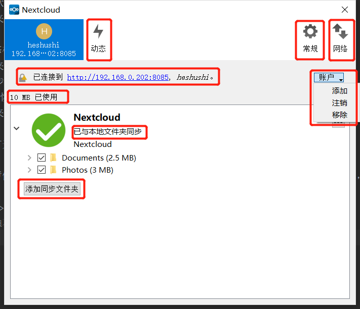
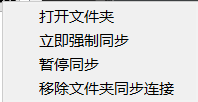

# 主界面介绍
窗口顶部是每个已配置的同步帐户的标签，另外三个用于“动态”，“常规”和“网络”设置。在您的帐户标签上，您具有以下功能：
* 连接状态，显示您连接到的Nextcloud服务器以及您的Nextcloud用户名。
* “ 帐户”按钮，其中包含“ 添加”，“ 注销”和“ 删除”的下拉菜单。
* 服务器上的已用空间和可用空间。
* 当前同步状态。
* 添加文件夹同步连接按钮。

位于同步状态栏右侧的带有三个点的小按钮（溢出菜单）提供了四个附加选项：
* 打开文件夹
* 选择要同步的内容（仅在折叠文件树时显示，并展开文件树）
* 暂停同步/恢复同步
* 删除文件夹同步连接

打开文件夹打开您的本地Nextcloud同步文件夹。

暂停同步会暂停同步操作，而不会对您的帐户进行任何更改。它将继续更新文件和文件夹列表，而无需下载或更新文件。要停止所有同步活动使用删除文件夹同步连接。

`注意` 
`Nextcloud不保留目录的mtime（修改时间）。`
