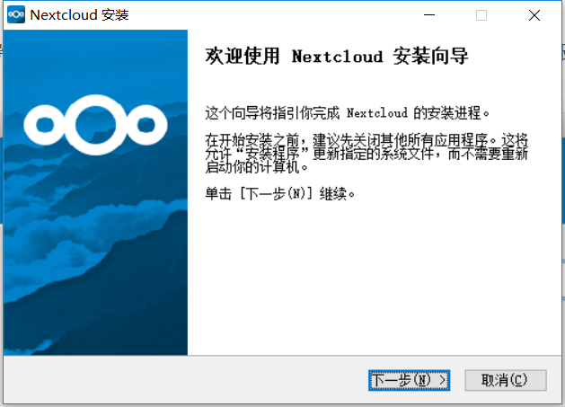
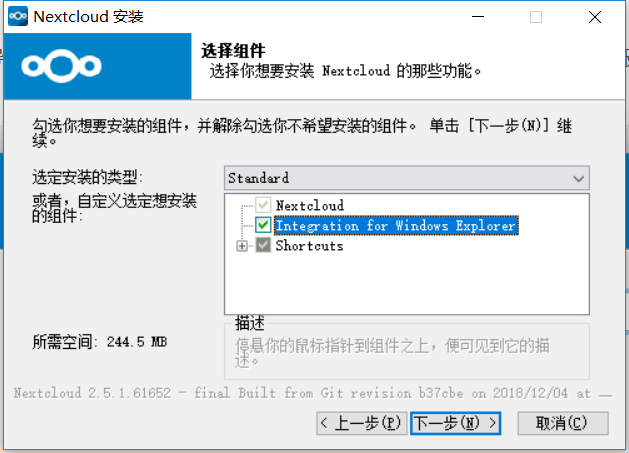
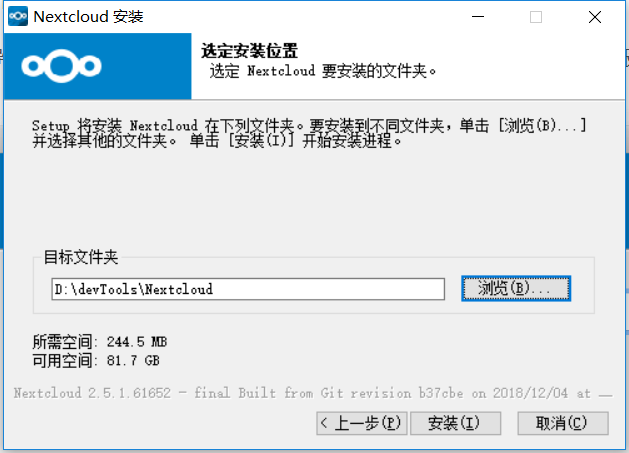
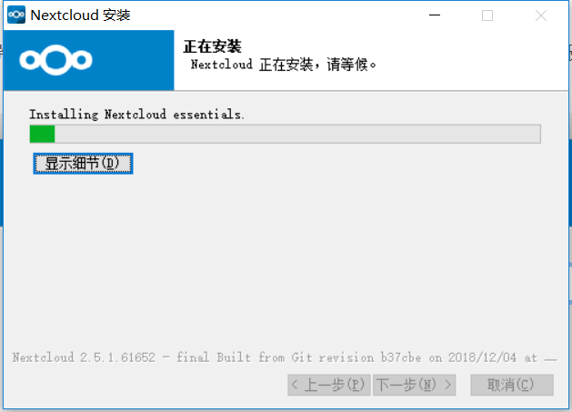
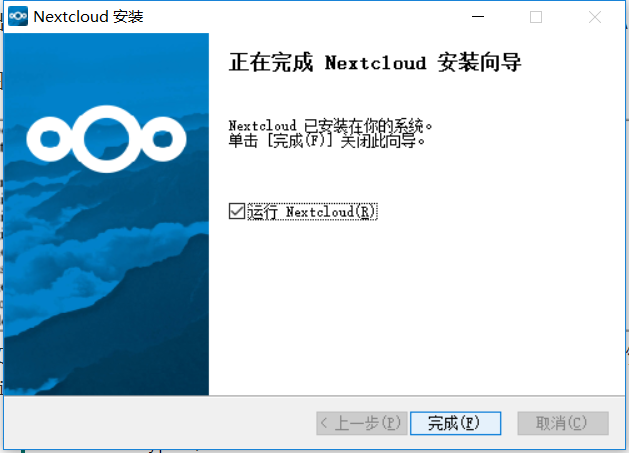

# 安装桌面同步客户端
您可以从[Nextcloud下载页面](https://nextcloud.com/install/#install-clients)下载最新版本的Nextcloud桌面同步客户端。有Linux，macOs和Microsoft Windows的客户端。

在Mac OS X和Windows上安装与任何软件应用程序相同：下载程序，然后双击它以启动安装，然后按照安装向导进行操作。安装和配置后，同步客户端将自动更新; 有关详细信息，请参阅[自动更新程序](https://docs.nextcloud.com/desktop/2.3/autoupdate.html)。

Linux用户必须按照下载页面上的说明为其Linux发行版添加适当的存储库，安装签名密钥，然后使用其软件包管理器安装桌面同步客户端。Linux用户还将通过包管理器更新其同步客户端，并且客户端将在更新可用时显示通知。

Linux用户还必须启用密码管理器，例如GNOME Keyring或KWallet，以便同步客户端可以自动登录。

您还可以在下载页面上找到源代码存档和旧版本的链接。

## 系统要求
* Windows 7+
* macOS 10.7+（仅限64位）
* CentOS 6和7（仅限64位）
* Debian 8.0和9.0
* Fedora 25＆26＆27
* Ubuntu 16.04＆17.04＆17.10
* openSUSE Leap 42.2和42.3

## 安装向导
下载完成后打开安装包

选择要安装的项目（一般默认就行）

选择安装目录

开始安装

安装完成

