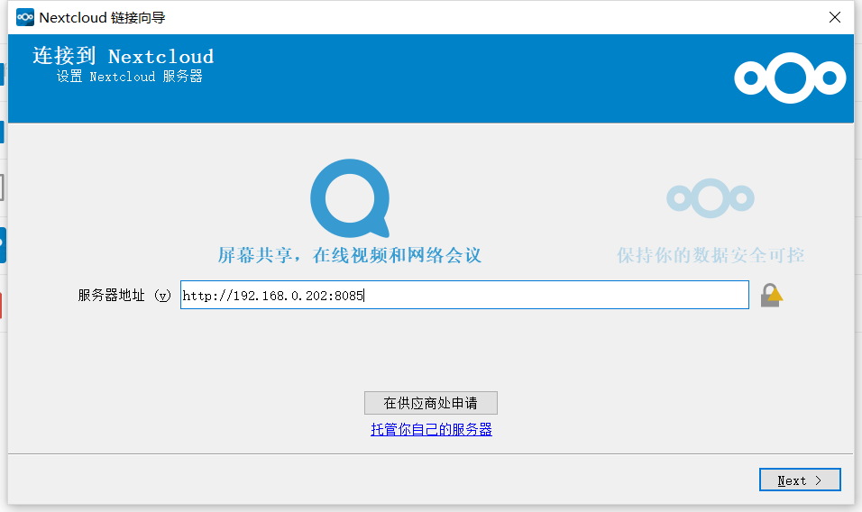
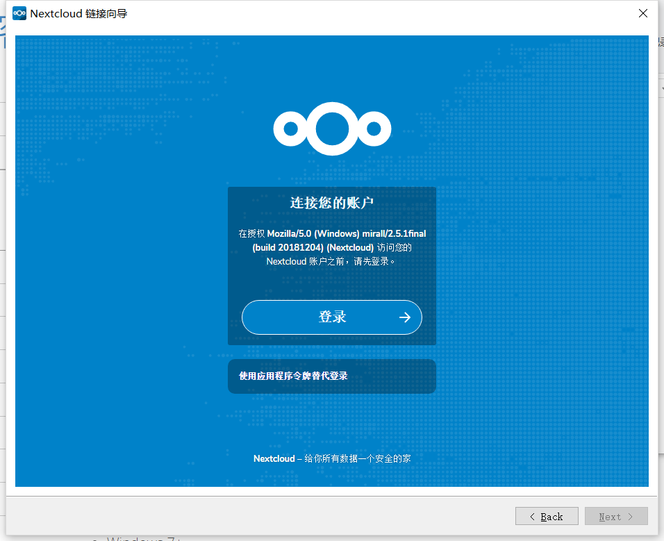
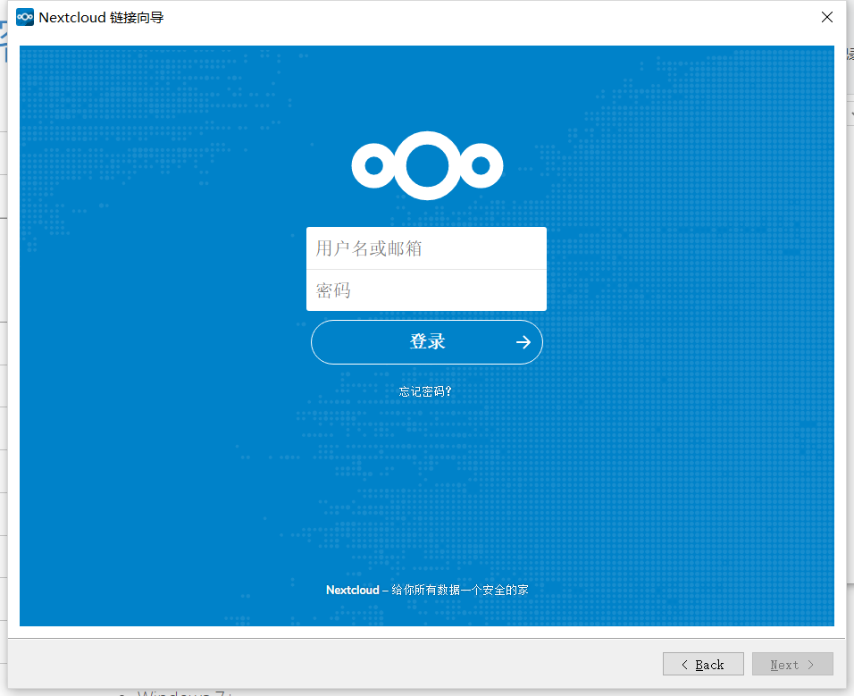
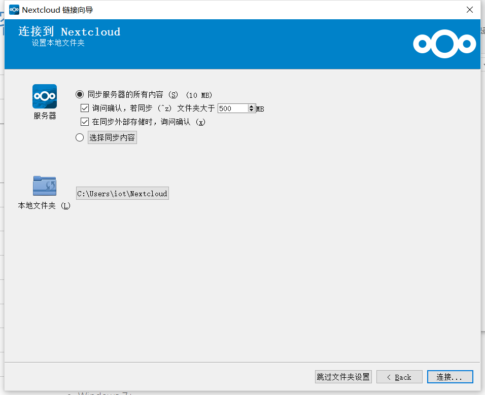
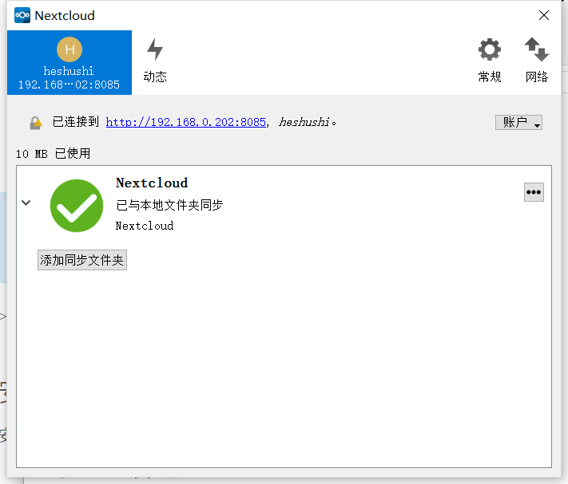

# 初次使用
打开已安装的nextcloud并设置nextcloud服务器地址

点击登陆

输入nextcloud账号密码

设置同布的选项和同步主目录

完成设置进入软件主界面

## 系统图标
Nextcloud桌面客户端保留在后台，在系统托盘（Windows，KDE），状态栏（macOS）或通知区域（Linux）中显示为图标。

| 描 述 | 图 标 |
|:--|:--|
| 同步是最新的，并且您已连接到Nextcloud服务器。 |  |
| 同步正在进行中。 |  |
| 同步已暂停。 |  |
| 同步客户端已丢失与Nextcloud服务器的连接。 |  |
| 信息图标，因此您应该单击它以查看它告诉您的内容。 |  |
| 配置错误，例如错误的登录或服务器URL。 |  |

右键单击系统托盘图标将打开一个菜单，以便快速访问多个操作。

此菜单提供以下选项：
* 快速访问您的帐户
* 同步状态
* 最近的变化，显示最新的活动
* 设置
* 帮助菜单
* 暂停同步
* 一次登录或退出所有帐户的选项
* 退出Nextcloud，注销并关闭客户端

左键单击系统托盘图标可打开桌面客户端到帐户设置窗口。

## 文件同步
每次修改主目录下的文件后，软件都会把文件同步到服务器上。